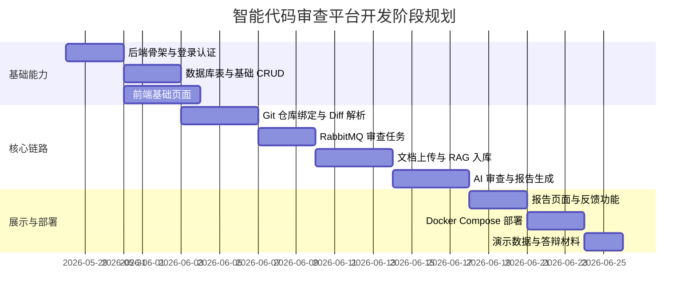
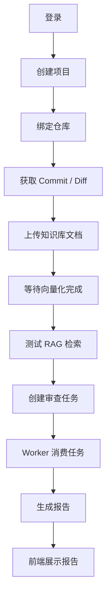

# 代码仓库智能审查平台开发前准备清单

## 1. 文档阅读顺序

建议正式开发前按以下顺序阅读：

1. `00_开发前准备清单.md`
2. `01_系统架构设计说明书.md`
3. `02_数据库设计说明书.md`
4. `03_接口设计文档.md`
5. `04_MQ与异步任务设计.md`
6. `05_RAG与AI审查设计.md`
7. `../代码仓库智能审查平台_需求规格说明书.md`

## 2. 第一版开发目标

第一版只追求完整闭环，不追求功能铺满。

```text
登录
↓
创建项目
↓
绑定 Git 仓库
↓
上传项目文档
↓
文档异步向量化
↓
手动触发代码审查
↓
RabbitMQ 异步消费任务
↓
RAG 检索项目上下文
↓
调用大模型生成 JSON 报告
↓
前端展示审查问题、证据、建议
↓
Docker Compose 部署到服务器
```

## 3. 开发阶段规划



## 4. 开发前必须确认的事项

| 项目 | 说明 | 状态 |
| --- | --- | --- |
| JDK | 建议 JDK 17 或 21 | 待确认 |
| Maven | 建议 Maven 3.9+ | 待确认 |
| Node.js | 建议 Node.js 20+ | 待确认 |
| Docker | 服务器和本地最好都安装 | 待确认 |
| PostgreSQL + pgvector | Docker Compose 启动 | 待确认 |
| RabbitMQ | Docker Compose 启动，开启管理台 | 待确认 |
| Redis | Docker Compose 启动 | 待确认 |
| 大模型 API Key | DeepSeek / 通义 / OpenAI-compatible 均可 | 待确认 |
| Embedding 模型 | 需要确认向量维度 | 待确认 |
| 演示 Git 仓库 | 准备一个 Java Spring Boot 示例仓库 | 待确认 |

## 5. 推荐项目目录

```text
code-review-platform
├── backend
├── frontend
├── model-service
├── deploy
│   ├── docker-compose.yml
│   ├── nginx.conf
│   └── init.sql
├── demo-repos
│   └── mall-order-service
├── docs
└── README.md
```

## 6. 演示仓库准备

建议准备一个小型 Spring Boot 项目作为演示仓库，名字可以叫：

```text
mall-order-service
```

该仓库至少包含：

- 用户模块。
- 订单模块。
- 支付状态字段。
- 发货接口。
- 管理员接口。
- MyBatis / JPA 数据访问代码。

故意准备 5 个有问题的 Commit：

| Commit | 缺陷类型 | 示例 |
| --- | --- | --- |
| commit-1 | AUTH_RISK | 管理接口缺少权限注解 |
| commit-2 | SQL_INJECTION | 使用字符串拼接 SQL |
| commit-3 | NULL_POINTER | 未判空直接调用对象方法 |
| commit-4 | TRANSACTION_RISK | 多表写入缺少事务 |
| commit-5 | BUSINESS_RULE_RISK | 发货前删除支付状态校验 |

## 7. 演示知识库准备

至少准备 4 份 Markdown 文档：

```text
README.md
docs/order-flow.md
docs/security-policy.md
docs/db-schema.md
docs/bug-history.md
```

其中 `order-flow.md` 必须写清楚：

```text
发货前必须校验订单支付状态为 PAID。
```

这样 AI 报告才能展示 RAG 证据链。

## 8. 第一版接口联调顺序



## 9. 开发里程碑验收

### 9.1 里程碑一：基础框架

- 后端项目能启动。
- 前端项目能启动。
- 登录接口可用。
- 数据库迁移脚本可执行。

### 9.2 里程碑二：Git 与任务

- 项目可以绑定仓库。
- 可以拉取 Commit 列表。
- 可以查看指定 Commit Diff。
- 创建审查任务后能投递 RabbitMQ。

### 9.3 里程碑三：RAG

- 可以上传 Markdown 文档。
- 可以异步切片和向量化。
- 可以输入 Query 检索相关 chunk。
- 检索结果带来源文件和相似度。

### 9.4 里程碑四：AI 审查

- Worker 能消费审查任务。
- 能构造 Prompt。
- 能调用大模型。
- 能解析 JSON 报告。
- 能保存 `review_report` 和 `review_issue`。

### 9.5 里程碑五：部署演示

- Docker Compose 能启动所有服务。
- 前端能访问后端。
- 后端能访问 PostgreSQL、RabbitMQ、Redis。
- 能完成一次完整审查演示。

## 10. 暂缓实现清单

以下功能先不要在第一版开发：

- GitHub / GitLab PR 自动评论。
- CodeBERT 微调。
- 多租户组织架构。
- 自动修复代码并提交 PR。
- 多语言代码审查。
- 复杂规则引擎。

这些功能可以写在简历和答辩的“后续扩展”中，不要影响第一版闭环。

