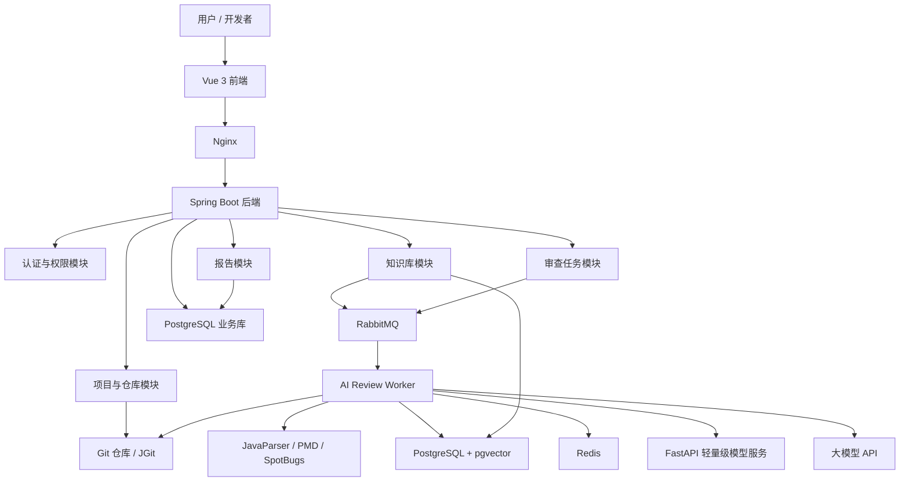
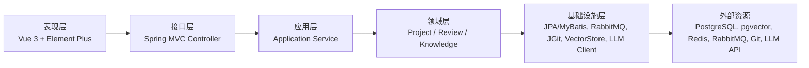
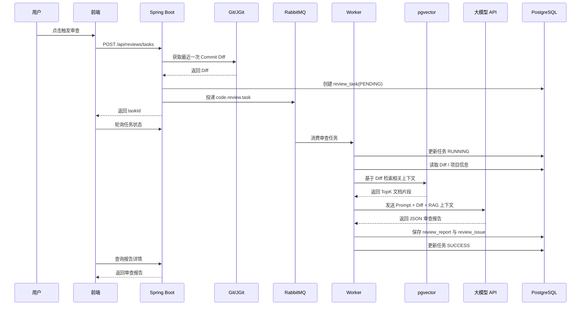
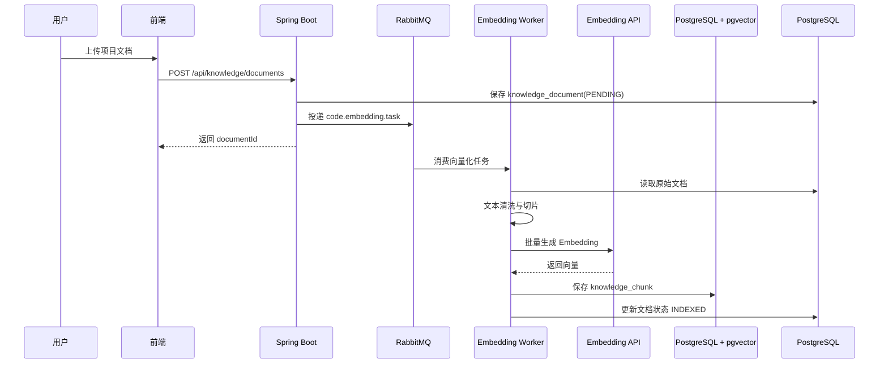
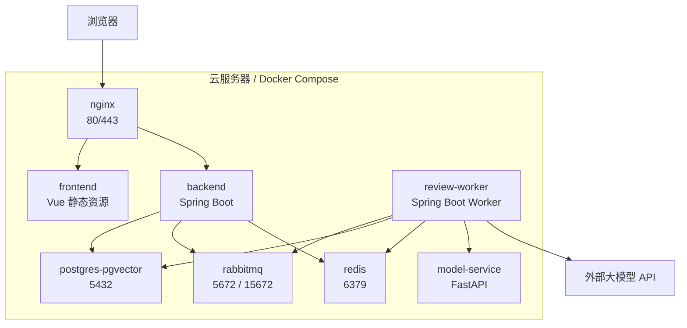

# 代码仓库智能审查平台系统架构设计说明书

## 1. 文档说明

本文档用于指导项目开发前的整体架构设计，明确系统边界、核心模块、调用流程、部署结构和第一版开发优先级。

项目名称：

> 基于 Spring Boot、RabbitMQ、RAG 与轻量级模型的代码仓库智能审查与缺陷定位平台

## 2. 架构目标

系统第一版需要满足以下目标：

- 支持 Java / Spring Boot 仓库的 Git Diff 审查。
- 支持文档上传、切片、向量化和 RAG 检索。
- 支持 RabbitMQ 异步执行耗时审查任务。
- 支持调用大模型生成结构化代码审查报告。
- 支持 Docker Compose 在服务器部署。
- 后续可扩展自训练轻量级模型、Webhook、PR 评论和多语言审查。

## 3. MVP 优先级

### 3.1 P0 必须完成

P0 是第一版最小可演示闭环。

| 模块 | 功能 |
| --- | --- |
| 用户认证 | 登录、JWT 鉴权 |
| 项目管理 | 创建项目、查看项目 |
| 仓库管理 | 绑定 Git 仓库、拉取最近一次 Commit Diff |
| 知识库 | 上传 Markdown / TXT 文档、切片、向量化、检索 |
| MQ 任务 | 创建审查任务、投递消息、消费消息、记录状态 |
| AI 审查 | RAG 检索上下文、调用大模型、解析 JSON 报告 |
| 报告展示 | 查看任务状态、查看审查报告、查看问题列表 |
| 部署 | Docker Compose 启动后端、前端、PostgreSQL、RabbitMQ、Redis |

### 3.2 P1 增强功能

| 模块 | 功能 |
| --- | --- |
| 轻量级模型 | TF-IDF + Logistic Regression 风险分类 |
| 静态扫描 | 接入 PMD / SpotBugs 扫描结果 |
| 反馈闭环 | 标记真实问题、误报、人工备注 |
| WebSocket | 实时推送任务进度 |
| PDF 导出 | 导出审查报告 |

### 3.3 P2 后续扩展

| 模块 | 功能 |
| --- | --- |
| Git Webhook | push 后自动触发审查 |
| PR 集成 | GitHub / GitLab PR 评论 |
| CodeBERT | 微调代码风险分类模型 |
| 多语言 | 支持 Python、JavaScript、Go |
| 自动修复 | 生成 Patch 建议 |

## 4. 总体架构



## 5. 分层架构



## 6. 核心模块职责

| 模块 | 职责 |
| --- | --- |
| auth | 用户登录、JWT 生成、接口鉴权 |
| project | 项目创建、项目查询、项目成员权限 |
| repository | 仓库绑定、Token 加密、Commit 与 Diff 获取 |
| knowledge | 文档上传、文本提取、切片、Embedding 入库 |
| review | 审查任务创建、状态管理、任务重试 |
| worker | 消费 MQ 消息、执行审查主流程 |
| rag | 向量检索、上下文拼装、证据来源管理 |
| ai | 大模型调用、Prompt 构造、JSON 解析 |
| model | 调用轻量级模型服务进行风险分类 |
| report | 审查报告、问题列表、证据和建议展示 |
| feedback | 误报标记、真实问题确认、训练数据积累 |

## 7. 代码审查时序图



## 8. 文档入库时序图



## 9. 部署架构



## 10. 推荐后端工程结构

```text
backend
├── src/main/java/com/example/codereview
│   ├── CodereviewApplication.java
│   ├── auth
│   ├── common
│   ├── project
│   ├── repository
│   ├── knowledge
│   ├── review
│   ├── report
│   ├── feedback
│   ├── mq
│   ├── rag
│   ├── ai
│   ├── git
│   ├── staticanalysis
│   └── config
└── src/main/resources
    ├── application.yml
    ├── db/migration
    └── prompts
```

## 11. 推荐前端页面

| 页面 | 路径 | 说明 |
| --- | --- | --- |
| 登录页 | /login | 用户登录 |
| 项目列表 | /projects | 查看项目 |
| 项目详情 | /projects/:id | 项目概览 |
| 仓库配置 | /projects/:id/repository | 绑定仓库 |
| 知识库 | /projects/:id/knowledge | 文档上传与检索测试 |
| 审查任务 | /projects/:id/reviews | 任务列表 |
| 报告详情 | /reports/:id | 查看问题、证据和建议 |
| 系统配置 | /settings | AI Key、模型、队列配置 |

## 12. 关键技术决策

| 决策 | 选择 | 原因 |
| --- | --- | --- |
| 后端框架 | Spring Boot 3 | Java 实习岗位匹配度高，生态成熟 |
| MQ | RabbitMQ | 异步任务、重试、死信队列实现简单 |
| 向量库 | PostgreSQL + pgvector | 部署轻量，业务表和向量表可共用数据库 |
| Git 操作 | JGit | Java 原生库，便于集成 |
| AI 集成 | Spring AI / HTTP Client | Spring 项目集成自然，必要时可兼容 OpenAI-like API |
| 模型训练 | Python + scikit-learn | 成本低，学生项目可落地 |
| 模型服务 | FastAPI | 快速提供预测接口 |
| 部署 | Docker Compose | 单服务器演示最稳 |

## 13. 环境变量建议

```text
APP_ENV=prod
SERVER_PORT=8080
JWT_SECRET=replace-me
DB_URL=jdbc:postgresql://postgres:5432/code_review
DB_USERNAME=code_review
DB_PASSWORD=replace-me
RABBITMQ_HOST=rabbitmq
RABBITMQ_USERNAME=guest
RABBITMQ_PASSWORD=guest
REDIS_HOST=redis
LLM_BASE_URL=https://api.example.com/v1
LLM_API_KEY=replace-me
LLM_CHAT_MODEL=deepseek-chat
LLM_EMBEDDING_MODEL=text-embedding-v3
MODEL_SERVICE_URL=http://model-service:8000
```

## 14. 主要风险与规避

| 风险 | 影响 | 规避方式 |
| --- | --- | --- |
| 功能过大 | 开发周期失控 | 先完成 P0 闭环，P1/P2 后置 |
| AI 输出不稳定 | JSON 解析失败 | 使用 JSON Schema、失败重试、降级报告 |
| RAG 检索不准 | 审查建议泛泛 | 增加 metadata、topK、关键词辅助检索 |
| Git Diff 太大 | Token 超限 | 限制文件数量和 diff 行数，超限提示 |
| MQ 重复消费 | 重复报告 | 基于 taskId 幂等控制 |
| API Key 泄露 | 安全风险 | 环境变量注入，日志脱敏 |

## 15. 第一版完成标志

满足以下条件即可认为架构闭环完成：

- 可以创建项目并绑定 Git 仓库。
- 可以上传文档并在 pgvector 中生成向量。
- 可以触发审查任务并进入 RabbitMQ。
- Worker 能消费任务，执行 RAG 检索并调用大模型。
- 系统能保存结构化报告和问题列表。
- 前端能展示问题、证据和修改建议。
- Docker Compose 能在服务器启动所有服务。

