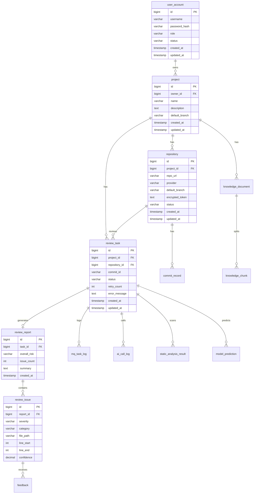

# 代码仓库智能审查平台数据库设计说明书

## 1. 设计目标

数据库设计需要支撑以下核心能力：

- 用户、项目、仓库、权限的基础管理。
- Git Commit 与 Diff 审查任务管理。
- RAG 知识库文档、切片和向量存储。
- AI 调用日志、模型预测结果、静态扫描结果追踪。
- 审查报告、问题列表和人工反馈沉淀。
- MQ 消息执行日志、重试和死信追踪。

第一版推荐使用 PostgreSQL，并安装 pgvector 扩展。业务数据和向量数据可以共用一个 PostgreSQL 实例，降低部署复杂度。

## 2. 命名规范

| 类型 | 规范 |
| --- | --- |
| 表名 | 小写下划线，如 `review_task` |
| 主键 | 统一使用 `id` |
| 外键 | 使用 `{entity}_id` |
| 时间字段 | `created_at`、`updated_at`、`deleted_at` |
| 状态字段 | 使用 `status` |
| 枚举字段 | 使用 varchar 保存枚举值 |
| 软删除 | 使用 `deleted_at`，第一版也可暂不实现 |

## 3. ER 图



## 4. 表结构设计

### 4.1 user_account

用于保存系统用户。

| 字段 | 类型 | 约束 | 说明 |
| --- | --- | --- | --- |
| id | bigint | PK | 用户 ID |
| username | varchar(64) | unique, not null | 用户名 |
| password_hash | varchar(255) | not null | 加密后的密码 |
| nickname | varchar(64) | nullable | 昵称 |
| role | varchar(32) | not null | ADMIN / DEVELOPER / REVIEWER |
| status | varchar(32) | not null | ENABLED / DISABLED |
| created_at | timestamp | not null | 创建时间 |
| updated_at | timestamp | not null | 更新时间 |

建议索引：

```sql
create unique index uk_user_account_username on user_account(username);
```

### 4.2 project

用于保存项目基础信息。

| 字段 | 类型 | 约束 | 说明 |
| --- | --- | --- | --- |
| id | bigint | PK | 项目 ID |
| owner_id | bigint | FK | 创建者 |
| name | varchar(128) | not null | 项目名称 |
| description | text | nullable | 项目描述 |
| default_branch | varchar(128) | nullable | 默认审查分支 |
| status | varchar(32) | not null | ACTIVE / ARCHIVED |
| created_at | timestamp | not null | 创建时间 |
| updated_at | timestamp | not null | 更新时间 |

建议索引：

```sql
create index idx_project_owner_id on project(owner_id);
```

### 4.3 repository

用于保存 Git 仓库配置。

| 字段 | 类型 | 约束 | 说明 |
| --- | --- | --- | --- |
| id | bigint | PK | 仓库 ID |
| project_id | bigint | FK | 项目 ID |
| repo_url | varchar(512) | not null | Git 仓库地址 |
| provider | varchar(32) | not null | GITHUB / GITLAB / GITEE / OTHER |
| default_branch | varchar(128) | not null | 默认分支 |
| encrypted_token | text | nullable | 加密后的访问 Token |
| local_path | varchar(512) | nullable | 服务端临时 clone 路径 |
| status | varchar(32) | not null | ACTIVE / ERROR |
| last_error | text | nullable | 最近一次错误 |
| created_at | timestamp | not null | 创建时间 |
| updated_at | timestamp | not null | 更新时间 |

约束建议：

```sql
create unique index uk_repository_project_id on repository(project_id);
```

### 4.3.1 pull_request

用于保存 Pull Request / Merge Request 主体信息，承接真实团队中的代码评审入口。

| 字段 | 类型 | 约束 | 说明 |
| --- | --- | --- | --- |
| id | bigint | PK | PR ID |
| project_id | bigint | FK | 项目 ID |
| repository_id | bigint | FK | 仓库 ID |
| provider | varchar(32) | not null | GITHUB / GITLAB / GITEE / OTHER |
| external_pr_id | varchar(128) | nullable | 外部平台 PR ID |
| pr_number | int | nullable | 外部平台 PR 编号 |
| title | varchar(255) | not null | PR 标题 |
| author_name | varchar(128) | nullable | 提交人 |
| source_branch | varchar(128) | not null | 源分支 |
| target_branch | varchar(128) | not null | 目标分支 |
| base_sha | varchar(80) | not null | 对比基准 |
| head_sha | varchar(80) | not null | 当前提交 |
| status | varchar(32) | not null | OPEN / CLOSED / MERGED |
| review_state | varchar(32) | not null | PENDING / PASSED / CHANGES_REQUESTED / WAIVED |
| last_synced_at | timestamp | nullable | 最近同步时间 |
| created_at | timestamp | not null | 创建时间 |
| updated_at | timestamp | not null | 更新时间 |

### 4.4 commit_record

用于记录已拉取的 Commit 信息。

| 字段 | 类型 | 约束 | 说明 |
| --- | --- | --- | --- |
| id | bigint | PK | Commit 记录 ID |
| repository_id | bigint | FK | 仓库 ID |
| commit_id | varchar(64) | not null | Commit SHA |
| parent_commit_id | varchar(64) | nullable | 父 Commit SHA |
| branch | varchar(128) | not null | 分支 |
| author_name | varchar(128) | nullable | 作者 |
| author_email | varchar(255) | nullable | 作者邮箱 |
| message | text | nullable | Commit message |
| committed_at | timestamp | nullable | 提交时间 |
| diff_summary | text | nullable | 变更摘要 |
| created_at | timestamp | not null | 创建时间 |

建议索引：

```sql
create unique index uk_commit_record_repo_commit on commit_record(repository_id, commit_id);
```

### 4.5 review_task

用于记录代码审查任务。

| 字段 | 类型 | 约束 | 说明 |
| --- | --- | --- | --- |
| id | bigint | PK | 任务 ID |
| project_id | bigint | FK | 项目 ID |
| repository_id | bigint | FK | 仓库 ID |
| commit_id | varchar(64) | not null | 被审查 Commit |
| base_commit_id | varchar(64) | nullable | 对比基准 Commit |
| branch | varchar(128) | not null | 分支 |
| pull_request_id | bigint | nullable | 关联 PR ID |
| trigger_user_id | bigint | FK | 触发用户 |
| trigger_type | varchar(32) | not null | MANUAL / WEBHOOK |
| status | varchar(32) | not null | PENDING / RUNNING / SUCCESS / FAILED / DEAD |
| retry_count | int | not null | 当前重试次数 |
| max_retry | int | not null | 最大重试次数 |
| diff_text | text | nullable | 本次审查 Diff |
| error_message | text | nullable | 失败原因 |
| started_at | timestamp | nullable | 开始时间 |
| finished_at | timestamp | nullable | 完成时间 |
| created_at | timestamp | not null | 创建时间 |
| updated_at | timestamp | not null | 更新时间 |

建议索引：

```sql
create index idx_review_task_project_status on review_task(project_id, status);
create unique index uk_review_task_commit on review_task(repository_id, commit_id);
```

说明：`uk_review_task_commit` 用于第一版防止同一个仓库同一个 Commit 重复审查。后续支持多次审查时，可改为普通索引并增加 `run_no`。

### 4.6 review_report

用于保存审查报告主体。

| 字段 | 类型 | 约束 | 说明 |
| --- | --- | --- | --- |
| id | bigint | PK | 报告 ID |
| task_id | bigint | FK, unique | 审查任务 ID |
| project_id | bigint | FK | 项目 ID |
| repository_id | bigint | FK | 仓库 ID |
| commit_id | varchar(64) | not null | Commit SHA |
| overall_risk | varchar(32) | not null | HIGH / MEDIUM / LOW / NONE |
| issue_count | int | not null | 问题数量 |
| high_count | int | not null | 高风险数量 |
| medium_count | int | not null | 中风险数量 |
| low_count | int | not null | 低风险数量 |
| summary | text | nullable | 总体总结 |
| raw_ai_response | text | nullable | 大模型原始响应 |
| created_at | timestamp | not null | 创建时间 |

### 4.7 review_issue

用于保存报告中的具体问题。

| 字段 | 类型 | 约束 | 说明 |
| --- | --- | --- | --- |
| id | bigint | PK | 问题 ID |
| report_id | bigint | FK | 报告 ID |
| severity | varchar(32) | not null | HIGH / MEDIUM / LOW |
| category | varchar(64) | not null | 风险类型 |
| file_path | varchar(512) | nullable | 文件路径 |
| line_start | int | nullable | 起始行 |
| line_end | int | nullable | 结束行 |
| title | varchar(255) | not null | 问题标题 |
| description | text | not null | 问题描述 |
| impact | text | nullable | 影响分析 |
| evidence | text | nullable | 证据来源 |
| suggestion | text | nullable | 修改建议 |
| confidence | numeric(5,4) | nullable | 置信度 |
| created_at | timestamp | not null | 创建时间 |

建议索引：

```sql
create index idx_review_issue_report_id on review_issue(report_id);
create index idx_review_issue_category on review_issue(category);
create index idx_review_issue_severity on review_issue(severity);
```

### 4.7.1 review_action

用于记录管理员基于 PR 审查报告做出的决策动作，支持通过、打回修改、风险豁免和评论。

| 字段 | 类型 | 约束 | 说明 |
| --- | --- | --- | --- |
| id | bigint | PK | 动作 ID |
| project_id | bigint | FK | 项目 ID |
| pull_request_id | bigint | FK | PR ID |
| report_id | bigint | nullable | 关联报告 ID |
| actor_id | bigint | FK | 操作人 |
| action_type | varchar(32) | not null | APPROVE / REQUEST_CHANGES / WAIVE / COMMENT |
| reason | text | nullable | 操作原因 |
| requirement_text | text | nullable | 整改要求 |
| selected_issue_ids | text | nullable | 关联问题 ID 列表 |
| created_at | timestamp | not null | 创建时间 |

### 4.8 knowledge_document

用于保存知识库原始文档。

| 字段 | 类型 | 约束 | 说明 |
| --- | --- | --- | --- |
| id | bigint | PK | 文档 ID |
| project_id | bigint | FK | 项目 ID |
| uploader_id | bigint | FK | 上传用户 |
| doc_type | varchar(64) | not null | README / API_DOC / DB_SCHEMA / BUG_HISTORY / STYLE_GUIDE |
| file_name | varchar(255) | not null | 文件名 |
| content_type | varchar(128) | nullable | MIME 类型 |
| file_size | bigint | nullable | 文件大小 |
| content_text | text | nullable | 提取后的文本 |
| content_hash | varchar(64) | not null | 内容哈希，用于去重 |
| status | varchar(32) | not null | PENDING / INDEXING / INDEXED / FAILED |
| error_message | text | nullable | 失败原因 |
| created_at | timestamp | not null | 创建时间 |
| updated_at | timestamp | not null | 更新时间 |

建议索引：

```sql
create index idx_knowledge_document_project on knowledge_document(project_id);
create unique index uk_knowledge_document_hash on knowledge_document(project_id, content_hash);
```

### 4.9 knowledge_chunk

用于保存文档切片和向量。

| 字段 | 类型 | 约束 | 说明 |
| --- | --- | --- | --- |
| id | bigint | PK | 切片 ID |
| document_id | bigint | FK | 文档 ID |
| project_id | bigint | FK | 项目 ID |
| doc_type | varchar(64) | not null | 文档类型 |
| source_name | varchar(255) | not null | 来源文件名 |
| source_path | varchar(512) | nullable | 来源路径 |
| section_title | varchar(255) | nullable | 所属标题 |
| chunk_index | int | not null | 切片序号 |
| content | text | not null | 切片内容 |
| content_hash | varchar(64) | not null | 切片哈希 |
| embedding_model | varchar(128) | not null | Embedding 模型 |
| embedding | vector | not null | 向量 |
| created_at | timestamp | not null | 创建时间 |

pgvector 索引示例：

```sql
create index idx_knowledge_chunk_project on knowledge_chunk(project_id);
create index idx_knowledge_chunk_embedding
on knowledge_chunk
using ivfflat (embedding vector_cosine_ops)
with (lists = 100);
```

### 4.10 ai_call_log

用于记录大模型调用日志。

| 字段 | 类型 | 约束 | 说明 |
| --- | --- | --- | --- |
| id | bigint | PK | 日志 ID |
| task_id | bigint | FK | 审查任务 ID |
| provider | varchar(64) | not null | 模型提供方 |
| model_name | varchar(128) | not null | 模型名称 |
| prompt_hash | varchar(64) | nullable | Prompt 哈希 |
| request_preview | text | nullable | 脱敏后的请求摘要 |
| response_preview | text | nullable | 脱敏后的响应摘要 |
| prompt_tokens | int | nullable | 输入 Token |
| completion_tokens | int | nullable | 输出 Token |
| total_tokens | int | nullable | 总 Token |
| latency_ms | int | nullable | 响应耗时 |
| status | varchar(32) | not null | SUCCESS / FAILED |
| error_message | text | nullable | 错误原因 |
| created_at | timestamp | not null | 创建时间 |

### 4.11 static_analysis_result

用于保存静态扫描结果。

| 字段 | 类型 | 约束 | 说明 |
| --- | --- | --- | --- |
| id | bigint | PK | 结果 ID |
| task_id | bigint | FK | 审查任务 ID |
| tool_name | varchar(64) | not null | PMD / SpotBugs / JavaParser |
| rule_id | varchar(128) | nullable | 规则 ID |
| severity | varchar(32) | nullable | 严重等级 |
| file_path | varchar(512) | nullable | 文件路径 |
| line_start | int | nullable | 起始行 |
| message | text | nullable | 扫描信息 |
| raw_result | text | nullable | 原始结果 |
| created_at | timestamp | not null | 创建时间 |

### 4.12 model_prediction

用于保存轻量级模型预测结果。

| 字段 | 类型 | 约束 | 说明 |
| --- | --- | --- | --- |
| id | bigint | PK | 预测 ID |
| task_id | bigint | FK | 审查任务 ID |
| model_name | varchar(128) | not null | 模型名称 |
| model_version | varchar(64) | not null | 模型版本 |
| risk_type | varchar(64) | not null | 风险类型 |
| severity | varchar(32) | not null | 严重等级 |
| confidence | numeric(5,4) | not null | 置信度 |
| input_hash | varchar(64) | nullable | 输入哈希 |
| raw_response | text | nullable | 原始响应 |
| created_at | timestamp | not null | 创建时间 |

### 4.13 mq_task_log

用于记录 MQ 消息处理过程。

| 字段 | 类型 | 约束 | 说明 |
| --- | --- | --- | --- |
| id | bigint | PK | 日志 ID |
| task_id | bigint | nullable | 业务任务 ID |
| message_id | varchar(128) | not null | 消息 ID |
| exchange_name | varchar(128) | not null | 交换机 |
| routing_key | varchar(128) | not null | 路由键 |
| queue_name | varchar(128) | not null | 队列 |
| payload | text | nullable | 消息内容 |
| status | varchar(32) | not null | PUBLISHED / CONSUMED / FAILED / DEAD |
| retry_count | int | not null | 重试次数 |
| error_message | text | nullable | 错误信息 |
| created_at | timestamp | not null | 创建时间 |
| updated_at | timestamp | not null | 更新时间 |

### 4.14 feedback

用于保存人工反馈。

| 字段 | 类型 | 约束 | 说明 |
| --- | --- | --- | --- |
| id | bigint | PK | 反馈 ID |
| issue_id | bigint | FK | 问题 ID |
| user_id | bigint | FK | 反馈用户 |
| feedback_type | varchar(32) | not null | TRUE_POSITIVE / FALSE_POSITIVE / NEED_DISCUSSION |
| comment | text | nullable | 备注 |
| created_at | timestamp | not null | 创建时间 |

## 5. 枚举定义

### 5.1 任务状态

```text
PENDING
RUNNING
SUCCESS
FAILED
DEAD
```

### 5.2 文档状态

```text
PENDING
INDEXING
INDEXED
FAILED
```

### 5.3 风险等级

```text
HIGH
MEDIUM
LOW
NONE
```

### 5.4 风险类型

```text
NULL_POINTER
SQL_INJECTION
AUTH_RISK
TRANSACTION_RISK
PERFORMANCE_RISK
CONCURRENCY_RISK
VALIDATION_RISK
BUSINESS_RULE_RISK
LOGGING_RISK
UNKNOWN
```

## 6. pgvector 初始化

```sql
create extension if not exists vector;
```

如果使用 1536 维 Embedding：

```sql
embedding vector(1536)
```

如果使用 1024 维 Embedding：

```sql
embedding vector(1024)
```

注意：向量维度必须与 Embedding 模型输出维度一致。

## 7. 数据保留策略

| 数据 | 保留策略 |
| --- | --- |
| 审查报告 | 默认长期保留 |
| MQ 日志 | 可保留 30 到 90 天 |
| AI 调用日志 | 保存脱敏摘要，避免保存完整密钥 |
| 临时仓库文件 | 审查完成后可清理 |
| 知识库文档 | 用户删除文档时同步删除切片 |

## 8. 第一版建表顺序

建议按以下顺序建表：

1. `user_account`
2. `project`
3. `repository`
4. `commit_record`
5. `knowledge_document`
6. `knowledge_chunk`
7. `review_task`
8. `review_report`
9. `review_issue`
10. `ai_call_log`
11. `mq_task_log`
12. `static_analysis_result`
13. `model_prediction`
14. `feedback`
