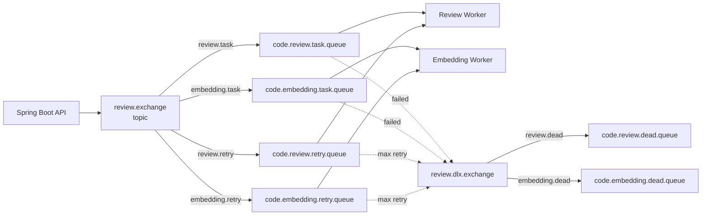
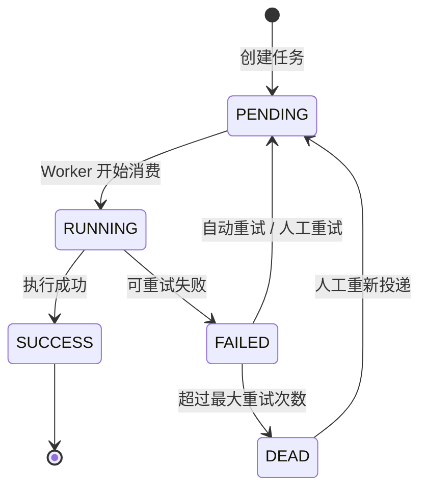
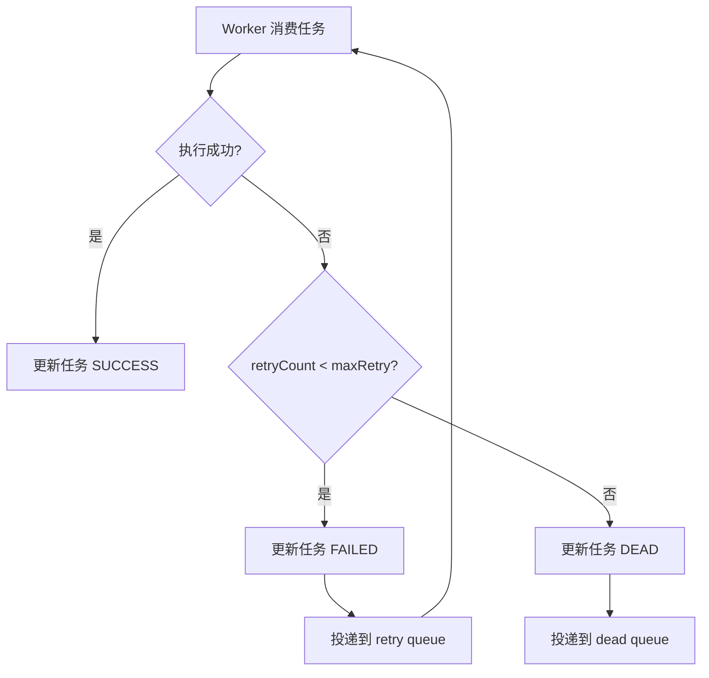
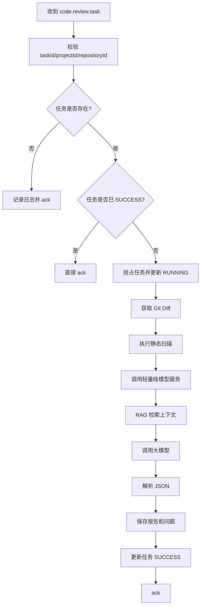
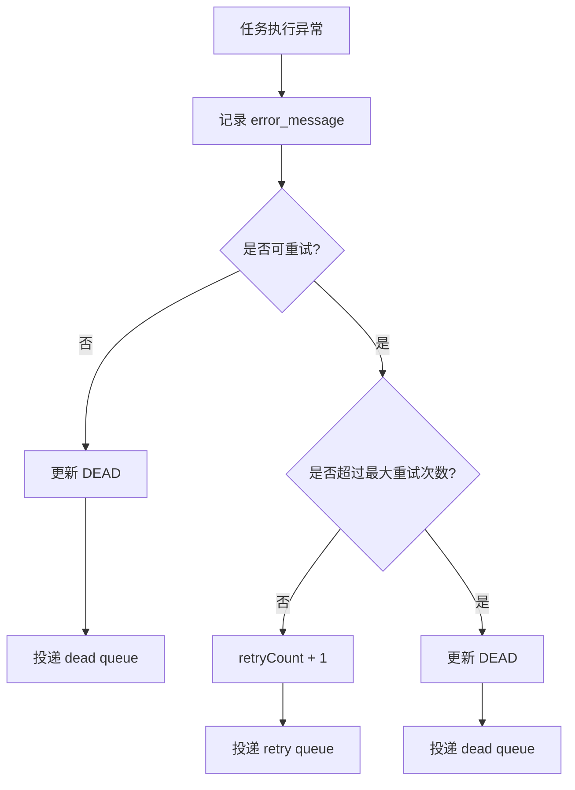

# 代码仓库智能审查平台 MQ 与异步任务设计

## 1. 设计目标

AI 审查、文档向量化、静态扫描等操作都属于耗时任务，不能在 HTTP 请求中同步执行。系统通过 RabbitMQ 实现异步任务调度、失败重试、死信记录和任务状态追踪。

核心目标：

- HTTP 接口快速返回任务 ID。
- 后台 Worker 异步消费任务。
- 失败任务可自动重试。
- 多次失败后进入死信队列。
- 同一个任务重复消费时保持幂等。
- 任务状态可被前端查询。

## 2. MQ 拓扑图



## 3. Exchange 与 Queue 设计

| 类型 | 名称 | 说明 |
| --- | --- | --- |
| exchange | review.exchange | 主业务交换机 |
| exchange | review.dlx.exchange | 死信交换机 |
| queue | code.review.task.queue | 代码审查任务队列 |
| queue | code.embedding.task.queue | 文档向量化任务队列 |
| queue | code.review.retry.queue | 代码审查重试队列 |
| queue | code.embedding.retry.queue | 文档向量化重试队列 |
| queue | code.review.dead.queue | 代码审查死信队列 |
| queue | code.embedding.dead.queue | 文档向量化死信队列 |

## 4. Routing Key 设计

| routing key | 目标队列 | 说明 |
| --- | --- | --- |
| review.task | code.review.task.queue | 创建代码审查任务 |
| embedding.task | code.embedding.task.queue | 创建文档向量化任务 |
| review.retry | code.review.retry.queue | 代码审查重试 |
| embedding.retry | code.embedding.retry.queue | 文档向量化重试 |
| review.dead | code.review.dead.queue | 代码审查死信 |
| embedding.dead | code.embedding.dead.queue | 文档向量化死信 |

## 5. 任务状态机



## 6. 代码审查任务消息

```json
{
  "messageId": "review-2001-abc123",
  "taskId": 2001,
  "projectId": 1,
  "repositoryId": 1,
  "commitId": "abc123",
  "baseCommitId": "def456",
  "branch": "main",
  "triggerUserId": 1,
  "retryCount": 0,
  "createdAt": "2026-05-28T12:00:00"
}
```

字段说明：

| 字段 | 说明 |
| --- | --- |
| messageId | MQ 消息唯一 ID |
| taskId | 审查任务 ID |
| projectId | 项目 ID |
| repositoryId | 仓库 ID |
| commitId | 被审查 Commit |
| baseCommitId | 对比基准 Commit |
| branch | 分支 |
| triggerUserId | 触发用户 |
| retryCount | 当前重试次数 |
| createdAt | 消息创建时间 |

## 7. 文档向量化任务消息

```json
{
  "messageId": "embedding-1001",
  "documentId": 1001,
  "projectId": 1,
  "docType": "API_DOC",
  "retryCount": 0,
  "createdAt": "2026-05-28T12:00:00"
}
```

## 8. 重试策略

第一版建议使用固定最大重试次数：

| 任务 | 最大重试次数 | 重试间隔 |
| --- | --- | --- |
| 代码审查任务 | 3 次 | 10s、30s、60s |
| 文档向量化任务 | 3 次 | 10s、30s、60s |

重试流程：



## 9. 幂等策略

### 9.1 为什么需要幂等

RabbitMQ 在网络抖动、Worker 异常退出或手动重试时，可能出现同一条消息被重复消费的情况。系统必须保证重复消费不会重复生成报告或重复写入脏数据。

### 9.2 审查任务幂等

消费 `code.review.task.queue` 时：

1. 根据 `taskId` 查询 `review_task`。
2. 如果状态为 `SUCCESS`，直接 ack，不重复执行。
3. 如果状态为 `RUNNING` 且 `updated_at` 很新，说明其他 Worker 正在处理，当前消息可拒绝或延迟重试。
4. 如果状态为 `PENDING` 或 `FAILED`，通过数据库乐观更新抢占任务。

抢占任务 SQL 思路：

```sql
update review_task
set status = 'RUNNING', started_at = now(), updated_at = now()
where id = :taskId
  and status in ('PENDING', 'FAILED');
```

如果影响行数为 0，说明任务已被其他 Worker 处理。

### 9.3 文档向量化幂等

消费 `code.embedding.task.queue` 时：

1. 根据 `documentId` 查询文档状态。
2. 如果状态为 `INDEXED`，直接 ack。
3. 如果重新向量化，先删除旧的 `knowledge_chunk`。
4. 使用 `content_hash` 防止重复文档反复入库。

## 10. 消费确认策略

建议使用手动 ack：

| 场景 | 操作 |
| --- | --- |
| 业务成功 | ack |
| 可重试异常 | ack 当前消息，主动投递 retry 消息 |
| 不可重试异常 | ack 当前消息，投递 dead 消息 |
| 系统崩溃 | 不 ack，由 RabbitMQ 重新投递 |

不可重试异常示例：

- 项目不存在。
- 仓库配置不存在。
- 文档不存在。
- AI 输出多次解析失败。

可重试异常示例：

- 大模型 API 超时。
- Embedding API 超时。
- Git 拉取临时失败。
- 数据库短暂连接失败。

## 11. Worker 并发控制

建议第一版：

| Worker | 并发数 |
| --- | --- |
| Review Worker | 1 到 2 |
| Embedding Worker | 1 到 2 |

原因：

- 大模型 API 有速率限制。
- 审查任务 Token 消耗较大。
- 学生服务器资源有限。

后续可以增加：

- 基于 Redis 的限流。
- 基于模型服务的最大并发控制。
- 根据任务类型分配不同 Worker。

## 12. 审查任务消费流程



## 13. 异常处理流程



## 14. MQ 日志记录

每次发送和消费消息都需要写入 `mq_task_log`。

建议记录：

- messageId
- taskId
- exchange
- routingKey
- queueName
- payload
- status
- retryCount
- errorMessage
- createdAt
- updatedAt

## 15. 第一版验收标准

MQ 模块完成后应能演示：

1. 创建审查任务后，数据库任务状态为 `PENDING`。
2. RabbitMQ 中出现审查任务消息。
3. Worker 消费消息后，任务状态变为 `RUNNING`。
4. 任务成功后，状态变为 `SUCCESS`。
5. 人为制造 AI 调用失败后，任务进入重试流程。
6. 连续失败 3 次后，任务进入 `DEAD`。
7. 同一条消息重复消费不会生成多份报告。

