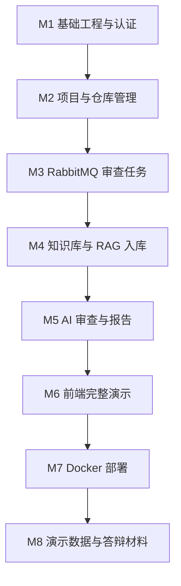

# 代码仓库智能审查平台开发任务拆解与里程碑计划

## 1. 目标

本文档把项目拆成可以逐步开发、逐步验收的任务。第一版目标不是做全功能，而是完成一个可以在实习面试中稳定演示的闭环。

第一版闭环：

```text
登录
↓
创建项目
↓
绑定 Git 仓库
↓
上传知识库文档
↓
文档异步向量化
↓
触发代码审查
↓
RabbitMQ 异步消费
↓
RAG 检索上下文
↓
调用大模型生成报告
↓
前端展示问题、证据、建议
```

## 2. 里程碑总览



## 3. M1 基础工程与认证

### 3.1 后端任务

| 编号 | 任务 | 产出 |
| --- | --- | --- |
| M1-BE-01 | 创建 Spring Boot 后端项目 | `backend` 项目可启动 |
| M1-BE-02 | 配置 PostgreSQL 连接 | 可连接数据库 |
| M1-BE-03 | 集成数据库迁移工具 | 可执行建表脚本 |
| M1-BE-04 | 实现统一响应结构 | `ApiResponse` |
| M1-BE-05 | 实现全局异常处理 | `GlobalExceptionHandler` |
| M1-BE-06 | 实现用户注册/登录 | `/api/auth/register`、`/api/auth/login` |
| M1-BE-07 | 实现 JWT 鉴权 | 需要 Token 才能访问业务接口 |

### 3.2 前端任务

| 编号 | 任务 | 产出 |
| --- | --- | --- |
| M1-FE-01 | 创建 Vue 3 项目 | `frontend` 项目可启动 |
| M1-FE-02 | 配置路由和请求封装 | `router`、`request` |
| M1-FE-03 | 登录页面 | 可登录并保存 Token |
| M1-FE-04 | 基础布局 | 顶部栏、侧边栏、内容区 |

### 3.3 验收标准

- 后端启动成功。
- 前端启动成功。
- 用户可以登录。
- 登录后能访问受保护接口。
- 未登录访问业务接口返回 401。

## 4. M2 项目与仓库管理

### 4.1 后端任务

| 编号 | 任务 | 产出 |
| --- | --- | --- |
| M2-BE-01 | 实现项目 CRUD | 项目增删改查 |
| M2-BE-02 | 实现仓库绑定 | 保存仓库 URL、分支、加密 Token |
| M2-BE-03 | 集成 JGit | 可 clone / pull 仓库 |
| M2-BE-04 | 获取 Commit 列表 | `/repository/commits` |
| M2-BE-05 | 获取 Commit Diff | `/repository/commits/{commitId}/diff` |
| M2-BE-06 | Diff 文件过滤 | 忽略二进制和无关目录 |

### 4.2 前端任务

| 编号 | 任务 | 产出 |
| --- | --- | --- |
| M2-FE-01 | 项目列表页 | 展示项目 |
| M2-FE-02 | 项目创建弹窗 | 创建项目 |
| M2-FE-03 | 仓库配置页 | 绑定 Git 仓库 |
| M2-FE-04 | Commit 列表页 | 展示 Commit |
| M2-FE-05 | Diff 预览页 | 展示变更文件 |

### 4.3 验收标准

- 可以创建项目。
- 可以绑定一个 Git 仓库。
- 可以读取最近 Commit。
- 可以查看某次 Commit Diff。

## 5. M3 RabbitMQ 审查任务

### 5.1 后端任务

| 编号 | 任务 | 产出 |
| --- | --- | --- |
| M3-BE-01 | 配置 RabbitMQ | exchange、queue、routing key |
| M3-BE-02 | 实现审查任务创建 | `review_task` 状态为 `PENDING` |
| M3-BE-03 | 投递审查任务消息 | `code.review.task.queue` |
| M3-BE-04 | 实现 Worker 消费者 | 消费消息并更新任务 |
| M3-BE-05 | 实现任务状态机 | PENDING / RUNNING / SUCCESS / FAILED / DEAD |
| M3-BE-06 | 实现重试与死信 | 失败 3 次进入死信 |
| M3-BE-07 | 实现幂等控制 | 同一 taskId 不重复生成结果 |

### 5.2 前端任务

| 编号 | 任务 | 产出 |
| --- | --- | --- |
| M3-FE-01 | 审查任务列表 | 展示任务状态 |
| M3-FE-02 | 触发审查按钮 | 创建任务 |
| M3-FE-03 | 任务状态轮询 | PENDING/RUNNING/SUCCESS |
| M3-FE-04 | 失败任务重试按钮 | 重试失败任务 |

### 5.3 验收标准

- 点击审查后生成任务。
- RabbitMQ 出现消息。
- Worker 能消费消息。
- 任务状态能从 PENDING 变成 RUNNING。
- 人为制造失败后能进入重试和死信。

## 6. M4 知识库与 RAG 入库

### 6.1 后端任务

| 编号 | 任务 | 产出 |
| --- | --- | --- |
| M4-BE-01 | 文档上传接口 | 支持 Markdown / TXT |
| M4-BE-02 | 文档状态管理 | PENDING / INDEXING / INDEXED / FAILED |
| M4-BE-03 | 投递向量化任务 | `code.embedding.task.queue` |
| M4-BE-04 | 文本清洗和切片 | chunkSize / overlap |
| M4-BE-05 | 调用 Embedding 模型 | 生成向量 |
| M4-BE-06 | 保存 pgvector | `knowledge_chunk` |
| M4-BE-07 | 实现检索接口 | `/knowledge/search` |

### 6.2 前端任务

| 编号 | 任务 | 产出 |
| --- | --- | --- |
| M4-FE-01 | 知识库文档列表 | 展示文档状态 |
| M4-FE-02 | 文档上传组件 | 上传 Markdown / TXT |
| M4-FE-03 | 检索测试页面 | 输入 query 返回 TopK |

### 6.3 验收标准

- 上传文档后状态为 PENDING。
- Worker 完成向量化后状态为 INDEXED。
- 输入“发货前是否要校验支付状态”能检索到对应文档片段。

## 7. M5 AI 审查与报告

### 7.1 后端任务

| 编号 | 任务 | 产出 |
| --- | --- | --- |
| M5-BE-01 | 提取 Diff 检索 Query | 文件名、类名、方法名、业务词 |
| M5-BE-02 | RAG 检索上下文 | TopK 相关文档 |
| M5-BE-03 | Prompt 模板管理 | `prompts/review.md` |
| M5-BE-04 | 调用大模型 API | 生成 JSON |
| M5-BE-05 | JSON Schema 校验 | 解析稳定 |
| M5-BE-06 | 保存报告主体 | `review_report` |
| M5-BE-07 | 保存问题列表 | `review_issue` |
| M5-BE-08 | AI 调用日志 | `ai_call_log` |

### 7.2 前端任务

| 编号 | 任务 | 产出 |
| --- | --- | --- |
| M5-FE-01 | 报告列表页 | 查看所有报告 |
| M5-FE-02 | 报告详情页 | 展示风险统计 |
| M5-FE-03 | 问题卡片 | 展示文件、行号、证据、建议 |
| M5-FE-04 | 风险筛选 | 按 HIGH/MEDIUM/LOW 筛选 |

### 7.3 验收标准

- Worker 能调用 RAG 检索。
- Worker 能调用大模型。
- AI 输出能解析成报告。
- 报告中包含问题、证据来源和建议。

## 8. M6 前端完整演示

### 8.1 页面清单

| 页面 | 必须完成 |
| --- | --- |
| 登录页 | 是 |
| 项目列表页 | 是 |
| 项目详情页 | 是 |
| 仓库配置页 | 是 |
| Commit / Diff 页 | 是 |
| 知识库页面 | 是 |
| 审查任务页面 | 是 |
| 报告详情页 | 是 |

### 8.2 验收标准

- 不通过接口工具，仅通过前端即可完成一次完整演示。
- 页面能清楚展示 RabbitMQ 异步状态。
- 页面能清楚展示 RAG 证据来源。

## 9. M7 Docker 部署

### 9.1 任务

| 编号 | 任务 | 产出 |
| --- | --- | --- |
| M7-01 | 编写后端 Dockerfile | 后端镜像 |
| M7-02 | 编写前端 Dockerfile | 前端静态文件镜像 |
| M7-03 | 编写 docker-compose.yml | 一键启动 |
| M7-04 | 编写 Nginx 配置 | 前端和 API 代理 |
| M7-05 | 初始化数据库脚本 | 建库、pgvector 扩展 |
| M7-06 | 编写部署说明 | 服务器运行步骤 |

### 9.2 验收标准

- 服务器执行 `docker compose up -d` 后服务启动。
- 前端可访问。
- 后端健康检查通过。
- RabbitMQ 管理台可访问。
- PostgreSQL 中存在业务表和 pgvector 扩展。

## 10. M8 演示数据与答辩材料

### 10.1 任务

| 编号 | 任务 | 产出 |
| --- | --- | --- |
| M8-01 | 准备演示 Java 仓库 | `mall-order-service` |
| M8-02 | 准备 5 个缺陷 Commit | 可触发不同风险 |
| M8-03 | 准备知识库文档 | order-flow、安全规范、DB schema |
| M8-04 | 准备演示脚本 | 5 分钟演示流程 |
| M8-05 | 准备简历描述 | 项目经历表达 |
| M8-06 | 准备面试问答 | MQ、RAG、AI、部署 |

## 11. 推荐开发顺序

不要一开始做自训练模型。推荐顺序：

1. 后端基础框架。
2. 用户和项目。
3. Git Diff。
4. RabbitMQ。
5. RAG 文档入库。
6. AI 审查报告。
7. 前端展示。
8. Docker 部署。
9. 轻量级模型增强。

## 12. 风险控制

| 风险 | 应对 |
| --- | --- |
| 大模型 API 不稳定 | 先用 Mock AI 审查结果跑通流程 |
| pgvector 配置复杂 | 用 Docker 镜像统一环境 |
| Git 仓库访问失败 | 第一版优先支持公开仓库 |
| 前后端联调耗时 | 先写接口文档和 Mock 数据 |
| RAG 效果不好 | 准备明确的演示文档和缺陷 Commit |

