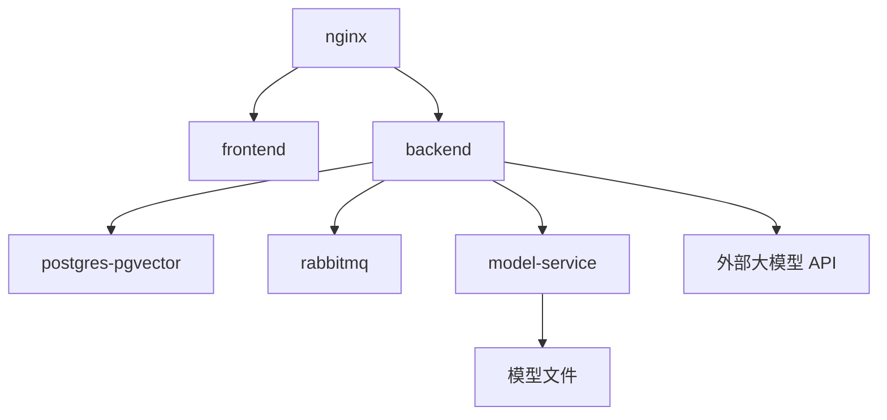

# 代码仓库智能审查平台部署环境与配置清单

## 1. 部署目标

第一版部署目标：

- 本地开发环境可以启动后端、前端和基础中间件。
- 云服务器可以通过 Docker Compose 启动完整演示环境。
- 配置项通过环境变量管理，避免把密钥写死在代码中。

## 2. 推荐服务器配置

| 项目 | 推荐 |
| --- | --- |
| CPU | 2 核及以上 |
| 内存 | 4 GB 及以上 |
| 磁盘 | 40 GB 及以上 |
| 系统 | Ubuntu 22.04 / 24.04 |
| 网络 | 可访问大模型 API |

如果服务器内存只有 2 GB，建议：

- 不部署本地大模型。
- FastAPI 轻量级模型服务可暂缓。
- RabbitMQ、PostgreSQL 都使用较小内存配置。

## 3. 端口规划

| 服务 | 容器端口 | 对外端口 | 说明 |
| --- | --- | --- | --- |
| Nginx | 80 | 80 | 前端和 API 代理 |
| Backend | 8080 | 不直接暴露 | Spring Boot |
| Frontend | 80 | 不直接暴露 | Vue 静态资源 |
| PostgreSQL | 5432 | 可不暴露 | 数据库和 pgvector |
| RabbitMQ | 5672 | 可不暴露 | MQ 协议端口 |
| RabbitMQ UI | 15672 | 15672 | 管理台，演示时可暴露 |
| Model Service | 8000 | 可不暴露 | FastAPI 模型服务 |

## 4. 环境变量

### 4.1 后端环境变量

```text
APP_ENV=prod
SERVER_PORT=8080

DB_URL=jdbc:postgresql://postgres:5432/code_review
DB_USERNAME=code_review
DB_PASSWORD=change-me

RABBITMQ_HOST=rabbitmq
RABBITMQ_PORT=5672
RABBITMQ_USERNAME=guest
RABBITMQ_PASSWORD=guest

JWT_SECRET=change-me-to-long-random-string
TOKEN_ENCRYPT_KEY=change-me-32-bytes

AI_PROVIDER=openai-compatible
LLM_BASE_URL=https://token-plan-cn.xiaomimimo.com/v1
LLM_API_KEY=change-me
LLM_CHAT_MODEL=mimo-v2.5-pro
EMBEDDING_PROVIDER=mock

RAG_MODE=memory
RAG_FULL_CONTEXT=true
RAG_MAX_CONTEXT_CHARS=6000

MODEL_SERVICE_ENABLED=true
MODEL_SERVICE_URL=http://model-service:8000
```

> 完整变量与默认值见根目录 `README.md` 的「配置项说明」。

### 4.2 前端环境变量

```text
VITE_API_BASE_URL=/api
VITE_APP_TITLE=代码仓库智能审查平台
```

### 4.3 模型服务环境变量

```text
MODEL_PATH=/app/models/risk_classifier.joblib
MODEL_VERSION=v1
```

## 5. Docker Compose 服务清单



## 6. 推荐 docker-compose.yml 结构

正式写代码时建议放在：

```text
deploy/docker-compose.yml
```

服务列表：

```text
postgres
rabbitmq
backend
frontend
model-service
nginx
```

`model-service` 当前已接入后端审查链路，生产演示建议保持启动；低配服务器可临时设置 `MODEL_SERVICE_ENABLED=false`。

## 7. 数据库初始化

PostgreSQL 启动后需要确保 pgvector 扩展可用：

```sql
create extension if not exists vector;
```

容器启动时会先执行：

```text
deploy/init.sql
```

后端生产环境启动时还会执行：

```text
backend/src/main/resources/db/schema-postgres.sql
```

该脚本负责业务表、pgvector 表和索引的幂等初始化，随后由 JPA `ddl-auto=validate` 校验表结构。

初始化内容：

```sql
create database code_review;
create user code_review with password 'change-me';
grant all privileges on database code_review to code_review;
```

注意：具体脚本需要根据 PostgreSQL 镜像初始化机制调整。

## 8. Nginx 代理规则

推荐规则：

```text
/          -> frontend
/api       -> backend:8080
/rabbitmq  -> rabbitmq:15672，可选
```

生产环境不建议公开 RabbitMQ 管理台；学生演示环境可以临时开放。

## 9. 本地开发启动顺序

```text
1. 启动 PostgreSQL + pgvector
2. 启动 RabbitMQ
3. 启动 Spring Boot 后端
4. 启动 Vue 前端
5. 上传文档测试 RAG
6. 触发代码审查任务
```

## 10. 服务器部署步骤

```text
1. 安装 Docker 和 Docker Compose。
2. 上传项目代码到服务器。
3. 配置 .env 文件。
4. 执行 docker compose build。
5. 执行 docker compose up -d。
6. 检查容器状态。
7. 检查后端健康接口。
8. 访问前端页面。
9. 进行完整审查演示。
```

## 11. 健康检查

| 服务 | 检查方式 |
| --- | --- |
| Backend | `GET /actuator/health` |
| Frontend | 访问首页 |
| PostgreSQL | 后端启动日志无连接错误 |
| RabbitMQ | 管理台可访问，队列存在 |
| Model Service | `GET /health` |

## 12. 日志查看

常用命令：

```text
docker compose ps
docker compose logs backend
docker compose logs rabbitmq
docker compose logs postgres
docker compose logs model-service
```

## 13. 安全配置提醒

上线演示前必须确认：

- `.env` 不提交到 Git。
- `LLM_API_KEY` 不写入前端。
- Git Token 不明文返回。
- RabbitMQ 管理台密码不要使用默认值。
- Nginx 只暴露必要端口。
- AI 调用日志进行脱敏。

## 14. 最小部署验收

满足以下条件即可认为部署成功：

1. 前端页面可访问。
2. 登录接口正常。
3. PostgreSQL 表已创建。
4. RabbitMQ 队列已创建。
5. 文档上传后能异步向量化。
6. 审查任务能异步消费。
7. 报告能保存并展示。
