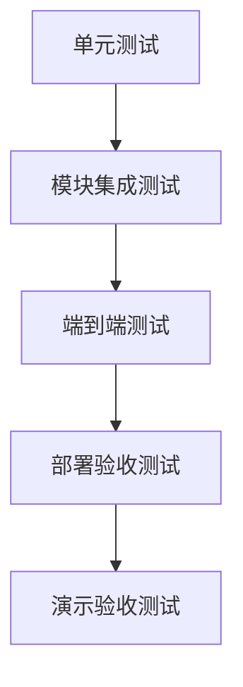

# 代码仓库智能审查平台测试与验收计划

## 1. 测试目标

测试目标是保证项目不是“能启动”，而是能稳定完成核心演示闭环。

重点验证：

- 用户认证和权限。
- Git 仓库绑定与 Diff 获取。
- RabbitMQ 异步任务、重试、死信和幂等。
- RAG 文档入库和相似度检索。
- AI JSON 输出解析与报告生成。
- 前端完整演示流程。
- Docker Compose 部署可用。

## 2. 测试分层



## 3. 单元测试范围

| 模块 | 测试内容 |
| --- | --- |
| Auth | 密码加密、Token 生成、Token 校验 |
| Git | URL 校验、Diff 文件过滤、Commit 解析 |
| RAG | 文本切片、metadata 构造、上下文拼装 |
| AI | Prompt 构造、JSON 提取、Schema 校验 |
| MQ | 消息体构造、状态转换 |
| Report | 风险统计、问题保存 |

## 4. 集成测试范围

### 4.1 用户与项目

| 用例 | 步骤 | 预期 |
| --- | --- | --- |
| 注册登录 | 注册用户后登录 | 返回 JWT |
| 未登录访问项目 | 不带 Token 访问项目接口 | 返回 401 |
| 创建项目 | 登录后创建项目 | 返回 projectId |

### 4.2 Git 仓库

| 用例 | 步骤 | 预期 |
| --- | --- | --- |
| 绑定公开仓库 | 输入公开 Git URL | 仓库状态 ACTIVE |
| 获取 Commit | 查询 Commit 列表 | 返回 commitId |
| 获取 Diff | 查询指定 Commit Diff | 返回文件变更 |
| 无效仓库 | 输入错误 URL | 返回 6001 |

### 4.3 RabbitMQ

| 用例 | 步骤 | 预期 |
| --- | --- | --- |
| 创建任务 | POST 创建审查任务 | 任务状态 PENDING |
| 消费任务 | Worker 消费消息 | 状态 RUNNING |
| 成功完成 | Worker 正常执行 | 状态 SUCCESS |
| 自动重试 | 模拟 AI 超时 | retryCount 增加 |
| 死信队列 | 连续失败 3 次 | 状态 DEAD |
| 幂等消费 | 重复投递同 taskId | 不重复生成报告 |

### 4.4 RAG

| 用例 | 步骤 | 预期 |
| --- | --- | --- |
| 上传文档 | 上传 order-flow.md | 状态 PENDING |
| 文档入库 | Worker 消费向量化任务 | 状态 INDEXED |
| 检索文档 | 搜索“发货支付状态” | 返回 order-flow 片段 |
| 删除文档 | 删除 document | chunk 同步删除 |

### 4.5 AI 审查

| 用例 | 步骤 | 预期 |
| --- | --- | --- |
| 正常审查 | 触发缺陷 Commit | 生成报告 |
| JSON 解析 | AI 返回合法 JSON | 保存 issue |
| JSON 修复 | AI 返回带 Markdown 的 JSON | 能提取 JSON |
| 解析失败 | AI 返回非 JSON | 记录失败并重试 |

## 5. 端到端测试

### 5.1 Happy Path

```text
1. 用户登录。
2. 创建项目。
3. 绑定 mall-order-service 仓库。
4. 上传 order-flow.md 和 security-policy.md。
5. 等待文档状态为 INDEXED。
6. 创建审查任务。
7. Worker 消费任务。
8. 任务状态变为 SUCCESS。
9. 查看报告详情。
10. 报告展示问题、证据和建议。
```

### 5.2 失败路径

```text
1. 配置错误的大模型 API Key。
2. 创建审查任务。
3. Worker 调用 AI 失败。
4. 任务自动重试。
5. 连续失败后进入 DEAD。
6. 前端展示失败原因。
7. 修改 API Key 后人工重试。
```

## 6. 验收指标

| 指标 | 目标 |
| --- | --- |
| 普通接口响应 | <= 2 秒 |
| 文档向量化 | 1 份 2000 字 Markdown 在 30 秒内完成 |
| 审查任务 | 普通 Diff 在 1 到 3 分钟内完成 |
| RAG TopK | 默认返回 5 条以内 |
| AI JSON 解析 | 合法 JSON 成功率 100% |
| MQ 重试 | 失败 3 次进入死信 |
| 演示缺陷识别 | 至少识别 3 类风险 |
| Docker 部署 | 一条 compose 命令启动全部核心服务 |

## 7. 演示缺陷验收

| 缺陷 | 预期风险 | 是否需要 RAG 证据 |
| --- | --- | --- |
| 管理接口缺少权限校验 | AUTH_RISK / HIGH | 是 |
| 字符串拼接 SQL | SQL_INJECTION / HIGH | 否 |
| 未判空直接调用方法 | NULL_POINTER / MEDIUM | 否 |
| 多表写入缺少事务 | TRANSACTION_RISK / HIGH | 可选 |
| 删除支付状态校验 | BUSINESS_RULE_RISK / HIGH | 是 |

## 8. 前端验收

| 页面 | 验收标准 |
| --- | --- |
| 登录页 | 登录成功后跳转项目列表 |
| 项目列表 | 可创建和查看项目 |
| 仓库配置 | 可绑定仓库并显示状态 |
| 知识库 | 可上传文档并显示 INDEXED |
| 审查任务 | 可触发任务并看到状态变化 |
| 报告详情 | 可看到风险统计、问题列表、证据来源 |

## 9. 部署验收

```text
docker compose ps
```

需要看到：

```text
backend        running
frontend       running
postgres       running
rabbitmq       running
redis          running
nginx          running
```

接口验收：

```text
GET /actuator/health -> UP
```

## 10. 答辩验收问题

准备回答：

1. 为什么 AI 审查要用 MQ 异步？
2. RabbitMQ 如何避免消息丢失？
3. 重复消费如何保证幂等？
4. RAG 相比直接调用大模型有什么优势？
5. pgvector 中 metadata 有什么作用？
6. AI 输出 JSON 解析失败怎么办？
7. 自训练模型和大模型分别负责什么？
8. 为什么第一版不训练大模型？
9. 如何部署到服务器？
10. 项目后续如何扩展到 PR 评论？

## 11. 测试完成标准

项目进入开发收尾前，至少完成：

- 10 个后端单元测试。
- 5 个核心接口集成测试。
- 1 条完整端到端演示流程。
- 1 次 Docker Compose 部署验收。
- 1 次故意失败的 MQ 死信演示。
