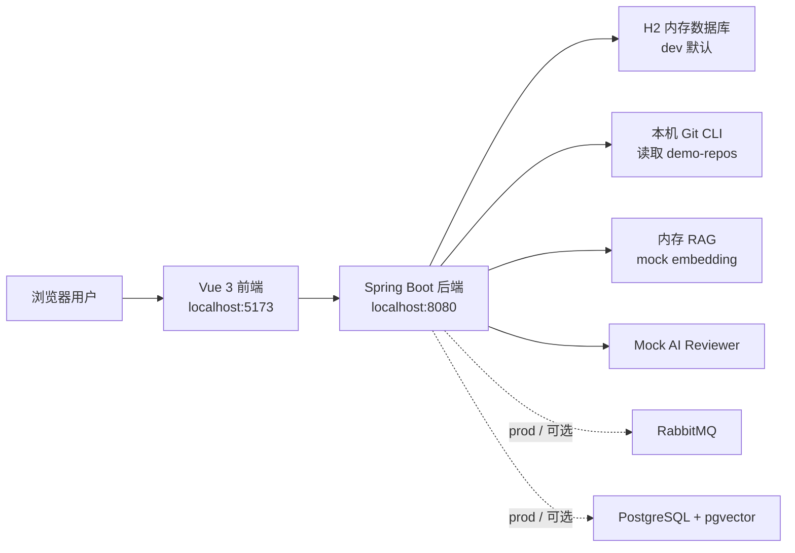
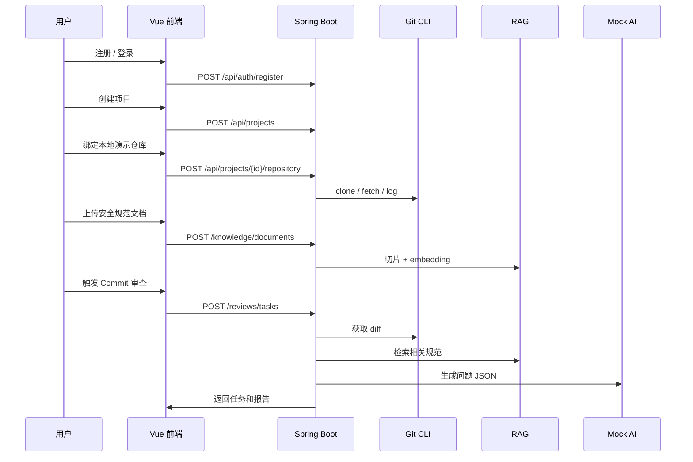

# 本地开发与联调手册

## 1. 手册目标

这份文档用于把项目从“代码已经有了”推进到“本地可以稳定演示”。它覆盖本机环境、启动顺序、接口联调、前后端联调、常见问题和最小验收路径。

## 2. 本地角色分工



开发环境默认走 H2、Mock AI、内存 RAG、inline 审查，所以不需要先安装 PostgreSQL、RabbitMQ 或申请大模型 Key。

## 3. 必备软件

| 软件 | 建议版本 | 用途 | 当前项目验证状态 |
| --- | --- | --- | --- |
| JDK | 17 | 运行 Spring Boot | 已验证 Java 17 可用 |
| Maven | 3.9+ | 构建后端 | 已验证，需使用 `.mvn/settings.xml` |
| Node.js | 20 LTS | 运行前端 | 项目通过 `.nvmrc` 固定主版本 |
| Git | 2.x | clone 和 diff 演示仓库 | 后端依赖本机 `git` 命令 |
| Docker Desktop/Engine | 支持 Compose v2 | 生产联调与 Testcontainers | 执行集成测试前必须保证 Docker 守护进程可用 |

工程兼容矩阵：

| 组件 | 支持基线 |
| --- | --- |
| Java | 17 |
| Node | 20 LTS |
| PostgreSQL | 16 + pgvector |
| RabbitMQ | 3.13 |
| Docker Compose | v2 |

Maven 需使用 3.9+。本项目不支持用 Java 8 或未声明版本的 Node 环境作为验收基线。

## 4. 目录说明

```text
backend        Spring Boot 后端
frontend       Vue 3 + Vite 前端
model-service  FastAPI 轻量模型服务骨架
deploy         Docker Compose、Nginx、初始化 SQL
demo-repos     本地演示仓库
docs           项目文档
```

## 5. 后端启动

进入后端目录：

```text
cd F:\202605New\backend
```

构建：

```text
mvn -s .mvn\settings.xml -q -DskipTests package
```

启动：

```text
mvn -s .mvn\settings.xml spring-boot:run
```

健康检查：

```text
GET http://localhost:8080/actuator/health
```

如果走 Nginx 或前端代理，API 路径仍然是 `/api/...`。

## 6. 前端启动

进入前端目录：

```text
cd F:\202605New\frontend
```

首次安装依赖：

```text
npm install --cache .npm-cache
```

启动：

```text
npm run dev
```

访问：

```text
http://localhost:5173
```

页面标题应显示：

```text
RepoSage 智能代码审查平台
```

构建验证：

```text
npm run build
```

## 7. 演示仓库准备

本项目已准备一个真实 Git 仓库：

```text
F:\202605New\demo-repos\mall-order-service
```

它包含两次提交：

| 提交 | 作用 |
| --- | --- |
| `feat: initial vulnerable mall order service` | 初始版本，包含 SQL 拼接、空指针、业务规则风险 |
| `feat: add admin force ship route` | 新增未鉴权管理接口，适合演示权限风险 |

绑定仓库时可以直接填写本地路径：

```text
F:\202605New\demo-repos\mall-order-service
```

默认分支填写：

```text
main
```

## 8. 推荐联调顺序



## 9. 最小演示流程

1. 打开前端页面。
2. 注册账号，例如 `developer / 123456`。
3. 创建项目，名称填写 `商城订单服务审查`。
4. 绑定本地演示仓库。
   前端仓库页面可点击“填入演示仓库”自动填充本机路径。
5. 上传知识库文档：

```text
F:\202605New\demo-repos\mall-order-service\docs\security-policy.md
F:\202605New\demo-repos\mall-order-service\docs\order-flow.md
```

6. 查询 commit 列表，选择最新 commit，页面会自动填入审查表单。
7. 触发审查任务。
8. 查看报告，dev 模式下会自动加载最新报告，预期出现 `AUTH_RISK`、`SQL_INJECTION`、`NULL_POINTER` 或业务规则类风险。
9. 对一个 issue 提交反馈，例如 `TRUE_POSITIVE`。
10. 查看 MQ 日志区域，dev inline 模式下也会保留任务处理日志。

## 10. 关键配置说明

| 配置 | dev 默认 | 说明 |
| --- | --- | --- |
| `APP_ENV` | `dev` | 使用 H2、关闭 Rabbit listener |
| `AI_PROVIDER` | `mock` | 使用规则型 Mock AI |
| `EMBEDDING_PROVIDER` | `mock` | 使用本地 mock embedding，真实聊天模型可与 mock embedding 混用 |
| `RAG_MODE` | `memory` | 向量检索模式（全量注入开启时不生效） |
| `RAG_FULL_CONTEXT` | `false` | 设 `true` 启用全量注入，把项目全部文档喂给大模型，不需要 embedding |
| `REVIEW_INLINE` | `true` | 创建任务后同步处理，方便本地演示 |
| `REVIEW_MAX_DIFF_CHARS` | `20000` | 限制传给 AI 的 diff 长度 |

切换真实 AI（以 MiMo 为例，无 embedding 接口，用全量注入）：

```text
AI_PROVIDER=openai-compatible
LLM_BASE_URL=https://token-plan-cn.xiaomimimo.com/v1
LLM_API_KEY=your-api-key
LLM_CHAT_MODEL=mimo-v2.5-pro
EMBEDDING_PROVIDER=mock
RAG_FULL_CONTEXT=true
```

如服务支持真实 Embedding 且想用向量检索（知识库很大时）：

```text
RAG_FULL_CONTEXT=false
RAG_MODE=pgvector
EMBEDDING_PROVIDER=openai-compatible
EMBEDDING_BASE_URL=https://你的embedding服务/v1
EMBEDDING_API_KEY=your-embedding-api-key
LLM_EMBEDDING_MODEL=你的embedding模型
```

## 11. 常见问题

### 11.1 Maven 无权限写入本地仓库

现象：Maven 尝试写入 `D:\Program Files\apache-maven-3.9.9\Repo` 并失败。

处理：始终使用项目内 settings：

```text
mvn -s .mvn\settings.xml -q -DskipTests package
```

### 11.2 npm cache 权限问题

处理：安装依赖时指定项目内缓存：

```text
npm install --cache .npm-cache
```

### 11.3 Docker 命令不可用

本地不影响 dev 演示，但 PostgreSQL、RabbitMQ 与 Flyway 的 Testcontainers 用例会明确跳过。跳过不代表生产基础设施验证通过；提交合并前应由启用 Docker 的开发机或 CI 完成这些测试。

### 11.4 RabbitMQ 没启动

dev 默认不需要 RabbitMQ。如果切换 `APP_ENV=prod` 或 `REVIEW_INLINE=false`，就必须启动 RabbitMQ。

### 11.5 报告没有 issue

优先检查：

- 是否绑定了 `demo-repos/mall-order-service`。
- 是否选择了最新 commit。
- 是否上传了 `security-policy.md`。
- 后端日志是否出现 Git diff 或 AI 解析异常。

## 12. 本地完成标准

本地准备完成需要满足：

- 后端构建通过。
- 前端构建通过。
- 前端页面可访问。
- 能注册登录。
- 能创建项目。
- 能绑定演示仓库。
- 能上传知识库文档并检索。
- 能触发审查并生成报告。
- 能提交 issue 反馈。
- 能解释 dev 模式和 prod 模式的区别。

## 13. 数据库迁移规范

生产数据库结构统一由 Flyway 管理，迁移文件位于：

```text
backend/src/main/resources/db/migration
```

开发约束：

1. 每次结构变化新增 `V<N>__description.sql`，版本号只能递增。
2. 已发布或已在共享环境执行的迁移不可编辑、改名或删除。
3. 对旧环境升级时，迁移必须兼容已有数据，必要时使用幂等 DDL 和分步回填。
4. `deploy/init.sql` 只负责数据库扩展等实例级初始化，不维护业务表。
5. 生产配置保持 `spring.sql.init.mode=never` 与 `spring.jpa.hibernate.ddl-auto=validate`。

## 14. 统一验证入口

在仓库根目录执行：

```text
.\scripts\verify-local.ps1 -SkipSmoke
```

该命令依次执行后端测试、前端测试、前端生产构建和模型加载检查。首次运行会把 Python 依赖安装到 `model-service/.python-packages`。需要验证完整 HTTP 链路时去掉 `-SkipSmoke`。

验收输出中若出现 Docker/Testcontainers `SKIP`，必须在有 Docker Compose v2 的环境补跑，不能把跳过记录为通过。
