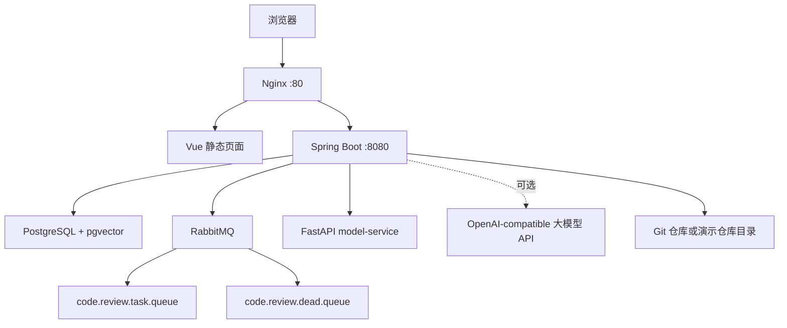

# 服务器部署与演示操作手册

## 1. 部署目标

本手册用于把 RepoSage 部署到一台云服务器上，形成可访问、可演示、可排障的完整环境。

最终对外入口：

- 前端页面：`http://服务器IP/`
- 后端健康检查：`http://服务器IP/actuator/health`
- RabbitMQ 管理台：`http://服务器IP:15672`

部署后的服务组成：



## 2. 推荐服务器配置

| 项目 | 建议 |
| --- | --- |
| 系统 | Ubuntu 22.04 / 24.04 LTS |
| CPU | 2 核及以上 |
| 内存 | 4 GB 及以上 |
| 磁盘 | 40 GB 及以上 |
| 开放端口 | `80` 必需，`15672` 可选 |
| 网络 | 能拉取 Docker 镜像，能访问 Git 仓库 |

学生展示建议选择 4 GB 内存。2 GB 服务器也能尝试，但建议使用 `AI_PROVIDER=mock`，并在演示前提前构建镜像。

## 3. 代码侧已补强点

这次部署前已针对审查发现的问题做了加固：

- 生产环境启动时执行 `backend/src/main/resources/db/schema-postgres.sql`，自动创建业务表和 pgvector 表。
- 生产环境仍使用 `spring.jpa.hibernate.ddl-auto=validate`，避免 Hibernate 随意改表。
- FastAPI 模型服务已接入 Java 审查链路，模型风险预判会进入审查上下文，并记录 `MODEL_RISK` AI 日志。
- MQ/AI 失败时任务状态独立提交，方便在服务器排障。
- 删除 RAG 文档时同步清理 pgvector 向量表。
- 同一 commit 支持按不同 `baseCommitId` 和分支重新审查。
- HTTPS 私有仓库 token 已用于 Git clone/fetch/pull 的认证头。
- 前端演示仓库路径改为可通过 `VITE_DEMO_REPO_PATH` 配置。

## 4. 首次部署

### 4.1 安装 Docker

在 Ubuntu 上可按下面步骤准备运行环境：

```bash
sudo apt update
sudo apt install -y ca-certificates curl git
curl -fsSL https://get.docker.com | sudo sh
sudo usermod -aG docker $USER
```

重新登录 SSH 后检查：

```bash
docker --version
docker compose version
git --version
```

### 4.2 获取项目代码

推荐通过 Git 获取：

```bash
git clone <你的仓库地址> code-review-platform
cd code-review-platform
```

确认目录中存在：

```bash
ls backend frontend model-service deploy demo-repos
```

初始化内置演示仓库：

```bash
bash scripts/init-demo-repo.sh
```

说明：GitHub 不会把嵌套目录里的 `.git` 目录当普通文件上传。这个脚本会在服务器上把 `demo-repos/mall-order-service` 初始化成可被后端 clone 的本地 Git 仓库。

### 4.3 配置环境变量

进入部署目录并复制配置：

```bash
cd deploy
cp .env.example .env
nano .env
```

最低可演示配置如下：

```env
APP_ENV=prod
SERVER_PORT=8080

DB_URL=jdbc:postgresql://postgres:5432/code_review
DB_USERNAME=code_review
DB_PASSWORD=change-me-to-a-strong-db-password

RABBITMQ_HOST=rabbitmq
RABBITMQ_PORT=5672
RABBITMQ_USERNAME=reposage
RABBITMQ_PASSWORD=change-me-to-a-strong-rabbit-password

JWT_SECRET=change-me-to-a-long-random-string
TOKEN_ENCRYPT_KEY=change-me-to-another-long-random-string

REVIEW_INLINE=false
RAG_MODE=pgvector

MODEL_SERVICE_ENABLED=true
MODEL_SERVICE_URL=http://model-service:8000
VITE_DEMO_REPO_PATH=/app/demo-repos/mall-order-service

AI_PROVIDER=mock
LLM_BASE_URL=https://api.example.com/v1
LLM_API_KEY=change-me
LLM_CHAT_MODEL=deepseek-chat
EMBEDDING_PROVIDER=mock
EMBEDDING_BASE_URL=https://api.example.com/v1
EMBEDDING_API_KEY=change-me
LLM_EMBEDDING_MODEL=text-embedding-v3
```

说明：

- `AI_PROVIDER=mock`：不依赖外部大模型，适合答辩现场稳定演示。
- `AI_PROVIDER=openai-compatible`：调用真实大模型，需要设置 `LLM_BASE_URL`、`LLM_API_KEY`、`LLM_CHAT_MODEL`。
- `EMBEDDING_PROVIDER=mock`：RAG 向量仍使用本地 mock embedding，适合只接入聊天模型的服务。
- `EMBEDDING_PROVIDER=openai-compatible`：RAG 向量调用真实 embedding 接口，需要设置 `EMBEDDING_BASE_URL`、`EMBEDDING_API_KEY`、`LLM_EMBEDDING_MODEL`。
- `MODEL_SERVICE_ENABLED=true`：启用自训练模型风险预判。
- `REVIEW_INLINE=false`：走 RabbitMQ 异步审查，更能体现消息队列。
- `VITE_DEMO_REPO_PATH=/app/demo-repos/mall-order-service`：前端“填入演示仓库”按钮会填这个容器内路径。

### 4.4 启动服务

在 `deploy` 目录执行：

```bash
docker compose up -d --build
```

首次构建会下载基础镜像、安装 Maven/NPM/Python 依赖，时间较长。启动完成后检查：

```bash
docker compose ps
```

预期看到这些服务为 `running` 或 `healthy`：

- `postgres`
- `rabbitmq`
- `backend`
- `model-service`
- `frontend`
- `nginx`

## 5. 健康检查

### 5.1 后端

```bash
curl http://127.0.0.1/actuator/health
```

预期：

```json
{"status":"UP"}
```

### 5.2 模型服务

```bash
docker compose exec model-service python - <<'PY'
from app.main import model_status
print(model_status().model_dump())
PY
```

预期 `modelLoaded=True`。

### 5.3 RabbitMQ

浏览器访问：

```text
http://服务器IP:15672
```

使用 `.env` 中的 `RABBITMQ_USERNAME` 和 `RABBITMQ_PASSWORD` 登录。

### 5.4 数据库表

```bash
docker compose exec postgres psql -U code_review -d code_review -c "\dt"
```

预期能看到：

- `user_account`
- `project`
- `code_repository`
- `knowledge_document`
- `knowledge_chunk`
- `knowledge_chunk_vector`
- `review_task`
- `review_report`
- `review_issue`
- `feedback`
- `mq_task_log`
- `ai_call_log`

## 6. 演示操作流程

```mermaid
flowchart LR
    A["打开 http://服务器IP/"] --> B["注册/登录"]
    B --> C["创建项目"]
    C --> D["进入仓库页"]
    D --> E["点击填入演示仓库"]
    E --> F["绑定仓库并加载 Commit"]
    F --> G["进入知识库页上传 docs/security-policy.md"]
    G --> H["测试 RAG 检索"]
    H --> I["选择 Commit 并触发审查"]
    I --> J["RabbitMQ 消费任务"]
    J --> K["模型服务风险预判"]
    K --> L["RAG 上下文 + AI 审查"]
    L --> M["查看报告/AI日志/MQ日志"]
    M --> N["提交人工反馈"]
```



具体步骤：

1. 打开 `http://服务器IP/`。
2. 注册账号，例如 `developer / 123456`。
3. 创建项目：`mall-order-service`，默认分支 `main`。
4. 进入“仓库”，点击“填入演示仓库”，再点击“绑定仓库”。
5. 点击“加载 Commit”，选择最新 commit。
6. 进入“知识库”，上传 `demo-repos/mall-order-service/docs/security-policy.md`。
7. 输入问题，例如 `admin endpoint authorization and paid order shipping rule`，点击测试检索。
8. 进入“审查”，触发审查任务。
9. 刷新报告，查看 `AUTH_RISK`、业务规则风险等问题。
10. 查看 AI 日志，应能看到 `MODEL_RISK`、`EMBEDDING_SEARCH`、`CHAT_REVIEW` 等记录。
11. 查看 MQ 日志，生产模式下应能看到 `PUBLISHED`、`CONSUMED` 等记录。
12. 对 issue 提交“真实问题/误报/需要讨论”反馈。

## 7. 真实大模型切换

如果要展示真实 AI API，将 `.env` 改为：

```env
AI_PROVIDER=openai-compatible
LLM_BASE_URL=https://你的大模型服务/v1
LLM_API_KEY=你的key
LLM_CHAT_MODEL=你的chat模型
EMBEDDING_PROVIDER=mock
LLM_EMBEDDING_MODEL=mock-embedding
```

如果你的服务同时支持 OpenAI-compatible embedding，也可以改为：

```env
AI_PROVIDER=openai-compatible
LLM_BASE_URL=https://你的聊天模型服务/v1
LLM_API_KEY=你的聊天key
LLM_CHAT_MODEL=你的chat模型
EMBEDDING_PROVIDER=openai-compatible
EMBEDDING_BASE_URL=https://你的embedding服务/v1
EMBEDDING_API_KEY=你的embedding-key
LLM_EMBEDDING_MODEL=你的embedding模型
```

重启后端：

```bash
docker compose up -d --build backend
docker compose logs -f backend
```

注意：

- 真实 embedding 维度和已入库 mock embedding 不一致时，建议清空旧知识库后重新上传文档。
- 答辩现场如果网络或余额不稳定，切回 `AI_PROVIDER=mock` 即可继续演示。

## 8. 私有仓库绑定

支持 HTTPS 仓库 token：

1. 在前端仓库页填写 HTTPS 仓库地址。
2. `Provider` 可填 `GITHUB`、`GITLAB`、`GITEE` 或 `OTHER`。
3. `accessToken` 填个人访问令牌。
4. 后端会 AES-GCM 加密存储 token，接口不返回明文。
5. clone/fetch/pull 时会自动通过 Git HTTP Header 带上 token。

建议答辩前优先使用公开仓库或内置演示仓库，私有仓库作为增强能力说明。

## 9. 常用运维命令

查看服务状态：

```bash
docker compose ps
```

查看后端日志：

```bash
docker compose logs -f backend
```

查看 RabbitMQ 日志：

```bash
docker compose logs -f rabbitmq
```

查看模型服务日志：

```bash
docker compose logs -f model-service
```

重启后端：

```bash
docker compose restart backend
```

重新构建并启动：

```bash
docker compose up -d --build
```

停止服务：

```bash
docker compose down
```

停止并删除数据库数据卷：

```bash
docker compose down -v
```

`down -v` 会删除数据库数据，只在需要重置演示环境时使用。

## 10. 升级部署

拉取新代码：

```bash
cd ~/code-review-platform
git pull
cd deploy
docker compose up -d --build
```

数据库结构由后端启动时的 `schema-postgres.sql` 幂等初始化。升级后检查：

```bash
docker compose logs backend --tail=100
curl http://127.0.0.1/actuator/health
```

## 11. 备份与恢复

备份数据库：

```bash
docker compose exec postgres pg_dump -U code_review code_review > reposage_backup.sql
```

恢复数据库：

```bash
cat reposage_backup.sql | docker compose exec -T postgres psql -U code_review -d code_review
```

如果只是实习演示，建议每次重要演示前备份一次。

## 12. 常见问题

| 问题 | 可能原因 | 处理方式 |
| --- | --- | --- |
| 前端打不开 | Nginx 未启动或安全组未开放 80 | `docker compose logs nginx`，检查云服务器安全组 |
| 后端 health 不是 UP | 数据库、RabbitMQ、配置错误 | `docker compose logs backend --tail=200` |
| 后端启动时报缺表 | schema 初始化未执行或 DB 权限不足 | 检查 `APP_ENV=prod`、`DB_USERNAME` 是否有建表权限 |
| 审查任务一直 PENDING | RabbitMQ 未消费或 backend 未连接 MQ | 看 RabbitMQ UI 和 `mq_task_log` |
| 审查任务 FAILED | Git、RAG、AI 或模型服务调用失败 | 前端查看任务错误、AI 日志、后端日志 |
| 知识库检索为空 | 未上传文档、embedding 不一致 | 重新上传文档，真实模型模式下避免混用旧 mock 向量 |
| 私有仓库 clone 失败 | Token 权限不足或仓库地址不对 | 先用服务器 `git clone` 验证 token 权限 |
| 模型服务无模型 | 镜像构建中训练失败 | `docker compose logs model-service` |
| 服务器内存不足 | 构建或多个服务占用过高 | 增加 swap，或先在本地构建镜像再部署 |

## 13. 答辩验收清单

- [ ] `docker compose ps` 核心服务均运行。
- [ ] `http://服务器IP/` 前端可打开。
- [ ] `http://服务器IP/actuator/health` 返回 `UP`。
- [ ] 注册/登录成功。
- [ ] 创建项目成功。
- [ ] 演示仓库绑定成功。
- [ ] Commit 列表加载成功。
- [ ] 知识库文档上传成功。
- [ ] RAG 检索能返回匹配片段。
- [ ] 审查任务从 `PENDING/RUNNING` 变为 `SUCCESS`。
- [ ] 报告中至少出现一个问题。
- [ ] AI 日志里能看到 `MODEL_RISK`。
- [ ] MQ 日志里能看到任务发布和消费记录。
- [ ] issue 反馈能保存。
- [ ] 能说明 Mock AI 与真实大模型如何切换。
- [ ] 能说明 RabbitMQ、RAG、pgvector、模型服务在项目中的作用。
