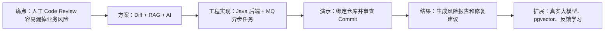
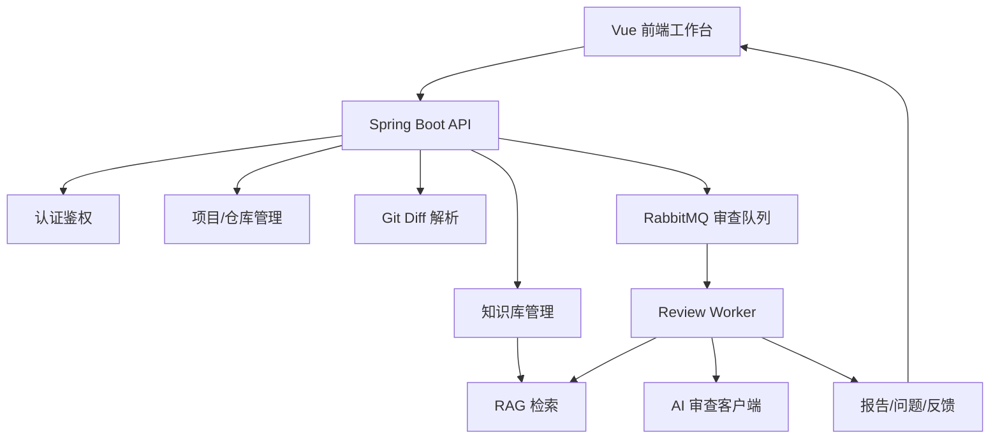

# 实习展示与答辩脚本

## 1. 项目一句话介绍

RepoSage 是一个基于 Spring Boot、RabbitMQ、RAG 和大模型接口的代码仓库智能审查平台。它可以绑定 Git 仓库，解析 Commit Diff，结合项目知识库检索业务规范，再调用 AI 生成缺陷定位报告，并通过人工反馈形成持续优化闭环。

## 2. 展示主线



## 3. 3 分钟版本

1. 先说明痛点：普通代码扫描工具更擅长语法和规则，但很难理解项目自己的业务约束。
2. 展示项目架构：前端、后端、Git、RabbitMQ、RAG、AI、报告模块。
3. 打开系统，注册登录，创建项目。
4. 绑定演示仓库 `mall-order-service`。
5. 上传 `security-policy.md` 和 `order-flow.md`。
6. 选择最新 commit，触发审查。
7. 展示报告中的高风险问题，例如管理接口缺少权限校验。
8. 强调：这个问题不是单纯靠语法发现，而是结合安全规范和 Diff 语义定位出来的。

## 4. 8 分钟版本

### 4.1 背景

现在团队代码增长很快，人工 Review 压力大。传统静态扫描能发现 SQL 注入、空指针等通用问题，但对“支付后才能发货”“管理员接口必须鉴权”这种业务规则识别较弱。

本项目的创新点是把仓库 Diff、项目知识库和 AI 审查结合起来：

- Git 负责提供变更上下文。
- RAG 负责从项目规范中找证据。
- 大模型负责理解 Diff 和生成结构化报告。
- RabbitMQ 负责把耗时审查变成异步任务。
- 反馈模块负责记录人工确认结果。

### 4.2 架构



### 4.3 演示

演示时按以下口径讲：

1. “我先创建一个项目，代表一个业务系统。”
2. “这里绑定 Git 仓库，后端会用 Git CLI 拉取 commit 和 diff。”
3. “知识库上传的是团队规范，例如安全要求和订单流程。”
4. “选择 Commit 后，页面会自动带出 commit 和 base commit，减少演示时手输错误。”
5. “触发审查后，任务会进入审查流程。生产环境走 RabbitMQ，本地开发可以 inline 处理。”
6. “审查报告包含风险等级、问题类型、证据、影响和修复建议。”
7. “最后这个反馈按钮代表人工确认结果，可以作为后续模型优化数据。”

### 4.4 结尾

这个项目不是简单调用 AI 接口，而是做了完整工程闭环：权限、仓库、异步任务、知识库、RAG、AI JSON 解析、报告落库、前端展示和部署配置。它符合实习项目对 Java 后端能力、工程落地能力和 AI 应用理解的要求。

## 5. 面试高频问题答案

### 5.1 为什么要用 RabbitMQ？

AI 审查是耗时任务，直接在接口里同步等待会导致请求超时、用户体验差，也不利于失败重试。用 RabbitMQ 后，创建任务和执行任务解耦，系统可以记录任务状态、重试失败任务，并把多次失败的任务转入死信队列。

### 5.2 RAG 有什么用？

直接把代码发给大模型，它只能根据通用经验判断。RAG 会先检索项目自己的规范、接口文档、历史缺陷，再把相关片段放进 Prompt，让 AI 根据项目上下文审查。例如“发货必须校验支付状态”就是项目知识库中的业务规则。

### 5.3 为什么不自己训练大模型？

学生项目第一版不适合训练大模型，因为成本高、数据要求高、部署难。更现实的路线是：大模型负责理解和生成报告，小模型负责风险分类或排序，人工反馈数据后续再用于轻量模型训练。

### 5.4 Mock AI 会不会太假？

Mock 是为了保证演示稳定，但系统已经抽象了 `AiReviewClient` 和 `EmbeddingClient`，可以通过环境变量切换到 OpenAI-compatible API。也就是说工程边界是真实的，Mock 只是本地和答辩兜底方案。

### 5.5 如何保证 AI 输出可落库？

后端要求 AI 输出结构化 JSON，字段包括风险等级、问题类型、文件路径、行号、证据、影响和建议。解析失败时任务会失败并进入重试流程，避免把不可控文本直接写入业务表。

### 5.6 项目最大的亮点是什么？

亮点不是“用了 AI”，而是把 AI 放进真实研发流程：Git Diff 输入、RAG 提供项目规范、MQ 异步执行、报告结构化落库、前端可视化、反馈闭环、Docker 可部署。

## 6. 展示时要重点点开的页面

| 页面 | 展示目的 |
| --- | --- |
| 登录/注册 | 基础系统完整性 |
| 项目列表 | 多项目管理 |
| 仓库配置 | Git 接入能力 |
| 知识库 | RAG 数据来源 |
| 审查任务 | MQ/异步任务概念 |
| 审查报告 | AI 结果落地 |
| 反馈按钮 | 持续优化闭环 |
| AI 日志 | 可观测性、真实 API 排错能力 |

## 7. 现场演示兜底

| 问题 | 兜底话术 |
| --- | --- |
| 大模型接口慢 | “演示环境切到 Mock，生产可通过环境变量接入真实 API。” |
| RabbitMQ 没起来 | “本地开发模式支持 inline 审查，生产环境使用 MQ。” |
| Docker 没装 | “当前已准备 Compose 文件，本地先展示 dev 流程。” |
| 问题数量少 | “演示仓库是可控样例，重点展示链路；扩展更多规则即可覆盖更多风险。” |

## 8. 简历描述

```text
RepoSage 智能代码审查平台：基于 Spring Boot、RabbitMQ、Vue3、RAG 和大模型接口实现 Git Commit Diff 智能审查。负责项目架构设计、后端接口、异步审查任务、知识库切片检索、AI 结构化报告生成、前端工作台和 Docker Compose 部署配置。项目支持 Mock AI 与 OpenAI-compatible API 切换，提供审查报告、风险定位、修复建议、AI 调用日志、轻量模型训练和人工反馈闭环。
```

## 9. 可量化表达

- 支持项目、仓库、知识库、审查任务、报告和反馈 6 个核心模块。
- 支持至少 4 类风险识别：权限风险、SQL 注入、空指针、业务规则风险。
- 支持 RabbitMQ 任务消费、失败重试、死信和 MQ 日志查询。
- 支持内存 RAG 和 PostgreSQL + pgvector 两种检索模式。
- 支持 AI 调用日志，记录模型、耗时、输入输出长度和失败原因。
- 支持本地 dev 演示和 Docker Compose 服务器部署。
