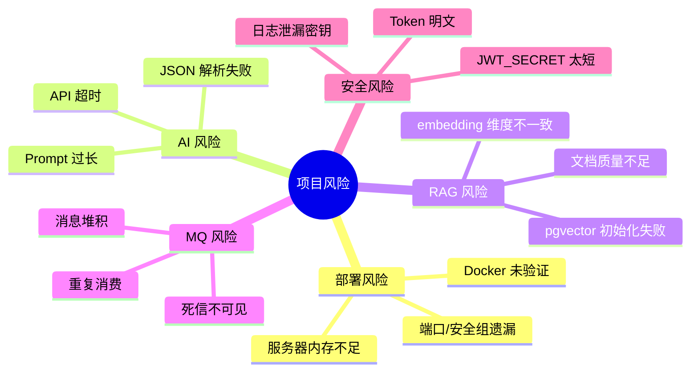
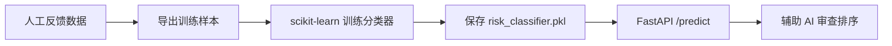
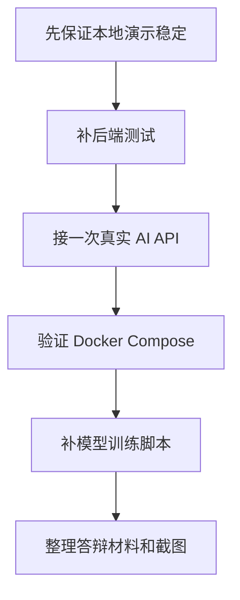

# 开发缺口与风险清单

## 1. 当前判断

项目已经具备实习展示的主链路雏形，但要从“能演示”提升到“更像真实项目”，还需要补齐以下准备和增强点。

## 2. 缺口优先级

| 优先级 | 缺口 | 影响 | 建议处理 |
| --- | --- | --- | --- |
| P0 | Docker 未在本机验证 | 服务器部署可能遇到镜像、网络、端口问题 | 找一台装 Docker 的机器或云服务器验证 |
| P0 | 自动化测试覆盖不足 | 答辩时仍需更多稳定性证明 | 已补基础 8 个测试，继续补 Git、Knowledge、ReviewProcessor、MQ、Feedback |
| P0 | 真实 AI API 未实测 | “AI 调接口”说服力不足 | 准备一个兼容 OpenAI 协议的 Key 做一次真实调用 |
| P1 | 私有 Git 仓库凭据场景仍需实测 | 已支持 HTTPS token 注入 Git 认证头，但未连接真实私有仓库验收 | 准备 GitHub/GitLab/Gitee 私有仓库做一次服务器验收 |
| P1 | pgvector 未在容器里验收 | RAG 生产模式说服力不足 | 用 Compose 跑 PostgreSQL + pgvector 并上传文档 |
| P1 | 模型服务训练数据较少 | “自己训练模型”已接入审查链路，但样本规模偏小 | 后续用人工反馈数据扩充样本并重训 |
| P1 | Prompt 明细日志不足 | 不方便复盘完整 Prompt | 已补 AI 调用日志表，后续可增加脱敏 Prompt 采样 |
| P2 | 缺少权限细粒度控制 | 多角色展示较弱 | 增加管理员/开发者角色差异 |
| P2 | 缺少 PR 集成 | 贴近企业场景不足 | 后续扩展 GitHub/GitLab webhook |

## 3. 技术风险雷达



## 4. 下一轮最值得做的 6 件事

### 4.1 继续补后端测试

已补基础测试：

- `TokenServiceTest`
- `MockAiReviewClientTest`
- `EmbeddingJsonTest`
- `AuthProjectIntegrationTest`

继续推荐补：

- `KnowledgeServiceTest`
- `RagServiceTest`
- `ReviewProcessorTest`
- `FeedbackControllerIntegrationTest`
- `RepositoryServiceTest`
- `ReviewTaskConsumerTest`

收益：能证明不是只有页面，后端质量也能经得起问。

### 4.2 增强 AI 调用日志

已新增 `ai_call_log`，记录：

```text
ai_call_log
- id
- project_id
- task_id
- provider
- model
- request_type
- prompt_chars
- response_chars
- status
- error_message
- latency_ms
- created_at
```

后续增强方向：

- 增加脱敏后的 Prompt 摘要。
- 记录 token usage，如果真实模型 API 返回 usage。
- 增加按状态、模型、时间范围过滤。

收益：答辩时能展示“可观测性”，也方便排查真实大模型问题。

### 4.3 增强私有仓库凭据使用

已完成：

- `CryptoService`
- `TOKEN_ENCRYPT_KEY`
- 保存前加密 `accessToken`
- 返回接口永不返回明文 token

后续增强：

- Git clone 私有仓库时临时解密 token。
- 避免 token 出现在命令行参数和日志中。
- 支持凭据过期后重新绑定。

收益：能回答安全设计问题，并能扩展到真实私有仓库。

### 4.4 增强轻量模型训练闭环



已完成第一版 TF-IDF + LogisticRegression 训练脚本、样例数据、模型文件加载和规则兜底。

后续增强：

- 从人工反馈表导出训练样本。
- 增加更多真实 diff 样本。
- 在后端审查流程中接入模型服务作为风险排序信号。

### 4.5 验证服务器部署

部署成功后补充截图：

- `docker compose ps`
- 前端首页
- RabbitMQ 队列
- 审查报告

这些截图非常适合实习展示和答辩 PPT。

### 4.6 增加 API 冒烟测试说明

把注册、创建项目、绑定仓库、上传文档、触发审查、提交反馈写成固定命令或脚本，避免每次手测漏步骤。

## 5. 是否影响当前展示

| 缺口 | 是否阻塞展示 |
| --- | --- |
| Docker 未验证 | 不阻塞本地展示，阻塞“服务器已部署”说法 |
| 真实 AI 未实测 | 不阻塞 Mock 展示，但面试官可能追问 |
| 自动化测试覆盖不足 | 不阻塞演示，继续补核心业务测试可增强工程质量观感 |
| 私有 Git token 使用未接入 clone | 不阻塞本地演示，后续可增强私有仓库场景 |
| 模型训练数据较少 | 不阻塞主线，后续可用反馈数据扩充样本 |

## 6. 推荐准备顺序



## 7. 当前最合理结论

这个项目已经可以作为实习展示项目继续开发。下一阶段不要再扩散功能，应该围绕“稳定、可解释、可部署、可答辩”收口：

- 稳定：测试和冒烟脚本。
- 可解释：答辩脚本和架构图。
- 可部署：Docker Compose 服务器验证。
- 可答辩：真实 AI 接入、RAG 证据、MQ 异步、反馈闭环。
