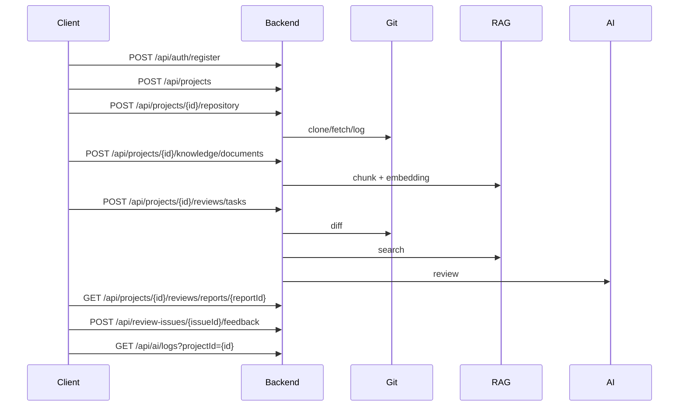

# API 冒烟测试用例

## 1. 目的

这份文档用于在后端启动后快速验证核心链路。它适合本地调试、答辩前检查、服务器部署后验收。

默认后端地址：

```text
http://localhost:8080
```

## 2. 响应格式

后端统一返回：

```json
{
  "code": 0,
  "message": "success",
  "data": {}
}
```

后续请求需要在 Header 中携带：

```text
Authorization: Bearer <token>
```

## 3. 一键脚本

后端启动后，可以直接在项目根目录运行：

```text
.\scripts\smoke-backend.ps1
```

指定后端地址：

```text
.\scripts\smoke-backend.ps1 -BaseUrl http://localhost:8080
```

指定演示仓库：

```text
.\scripts\smoke-backend.ps1 -RepoPath F:\202605New\demo-repos\mall-order-service
```

脚本会自动执行注册、创建项目、绑定仓库、上传知识库、RAG 搜索、触发审查、查询报告、提交反馈、查询 MQ 日志和查询 AI 调用日志。

## 4. 接口流程图



## 5. 健康检查

```text
GET /actuator/health
```

预期：

```json
{
  "status": "UP"
}
```

## 6. 注册

```http
POST /api/auth/register
Content-Type: application/json

{
  "username": "developer",
  "password": "123456",
  "nickname": "Developer"
}
```

记录返回的：

```text
data.token
```

## 7. 创建项目

```http
POST /api/projects
Authorization: Bearer <token>
Content-Type: application/json

{
  "name": "商城订单服务审查",
  "description": "用于演示 RAG + AI 代码审查"
}
```

记录：

```text
data.projectId
```

## 8. 绑定仓库

```http
POST /api/projects/{projectId}/repository
Authorization: Bearer <token>
Content-Type: application/json

{
  "repoUrl": "F:\\202605New\\demo-repos\\mall-order-service",
  "provider": "LOCAL",
  "defaultBranch": "main",
  "accessToken": ""
}
```

预期：

```text
data.status = ACTIVE
```

## 9. 查询 Commit

```http
GET /api/projects/{projectId}/repository/commits?limit=5
Authorization: Bearer <token>
```

记录最新：

```text
data[0].commitId
data[0].parentCommitId
```

## 10. 上传知识库文档

```http
POST /api/projects/{projectId}/knowledge/documents?docType=SECURITY
Authorization: Bearer <token>
Content-Type: multipart/form-data

file = F:\202605New\demo-repos\mall-order-service\docs\security-policy.md
```

建议再上传：

```text
F:\202605New\demo-repos\mall-order-service\docs\order-flow.md
F:\202605New\demo-repos\mall-order-service\docs\bug-history.md
```

## 11. 检索知识库

```http
POST /api/projects/{projectId}/knowledge/search
Authorization: Bearer <token>
Content-Type: application/json

{
  "query": "管理员接口必须鉴权，发货必须检查支付状态",
  "topK": 5
}
```

预期返回与安全规范或订单流程相关的 chunk。

## 12. 创建审查任务

```http
POST /api/projects/{projectId}/reviews/tasks
Authorization: Bearer <token>
Content-Type: application/json

{
  "commitId": "<commitId>",
  "baseCommitId": "<parentCommitId>",
  "branch": "main"
}
```

dev 模式下预期较快返回：

```text
data.status = SUCCESS
```

prod + RabbitMQ 模式下可能先返回：

```text
data.status = PENDING
```

需要轮询任务详情。

## 13. 查询任务

```http
GET /api/projects/{projectId}/reviews/tasks
Authorization: Bearer <token>
```

或：

```http
GET /api/projects/{projectId}/reviews/tasks/{taskId}
Authorization: Bearer <token>
```

## 14. 查询报告

```http
GET /api/projects/{projectId}/reviews/reports
Authorization: Bearer <token>
```

记录：

```text
data[0].reportId
```

详情：

```http
GET /api/projects/{projectId}/reviews/reports/{reportId}
Authorization: Bearer <token>
```

预期：

```text
overallRisk = HIGH
issues 至少包含 AUTH_RISK
```

## 15. 提交反馈

```http
POST /api/review-issues/{issueId}/feedback
Authorization: Bearer <token>
Content-Type: application/json

{
  "feedbackType": "TRUE_POSITIVE",
  "comment": "该问题符合项目安全规范，确认有效。"
}
```

查询反馈：

```http
GET /api/review-issues/{issueId}/feedback
Authorization: Bearer <token>
```

## 16. 查询 MQ 日志

```http
GET /api/mq/logs?taskId={taskId}
Authorization: Bearer <token>
```

预期能看到任务创建、处理成功或失败记录。

说明：dev 默认 `REVIEW_INLINE=true`，审查不会真正经过 RabbitMQ，因此 MQ 日志可能为空；prod 或 `REVIEW_INLINE=false` 时应能看到 publish/consume/retry/dead 记录。

## 17. 查询 AI 调用日志

按项目查询：

```http
GET /api/ai/logs?projectId={projectId}&limit=50
Authorization: Bearer <token>
```

按任务查询：

```http
GET /api/ai/logs?taskId={taskId}&limit=50
Authorization: Bearer <token>
```

预期至少能看到：

```text
EMBEDDING_INDEX
EMBEDDING_SEARCH
CHAT_REVIEW
```

字段包括 provider、model、promptChars、responseChars、latencyMs、status 和 errorMessage。

## 18. 冒烟通过标准

- [ ] 健康检查 `UP`。
- [ ] 注册或登录成功。
- [ ] 项目创建成功。
- [ ] 仓库绑定成功。
- [ ] Commit 列表可查询。
- [ ] 知识库文档上传成功。
- [ ] RAG 搜索有结果。
- [ ] 审查任务成功。
- [ ] 报告风险等级为 `HIGH`。
- [ ] 至少生成一个 issue。
- [ ] issue 反馈保存成功。
- [ ] MQ 日志可查询。
- [ ] AI 调用日志可查询。
